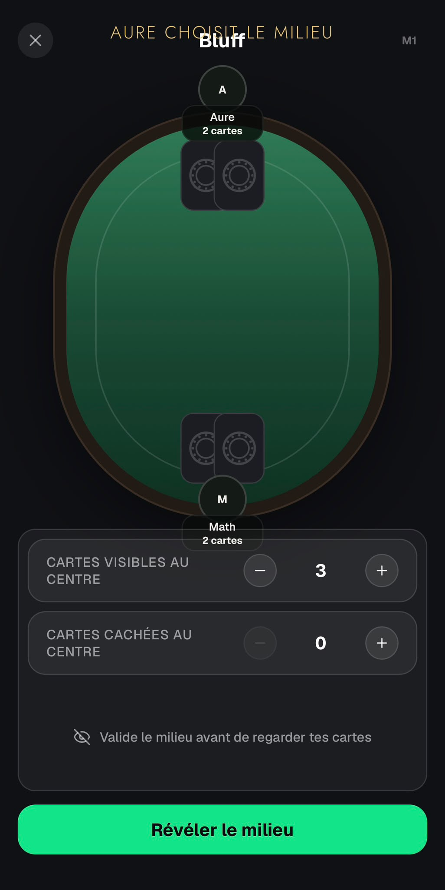
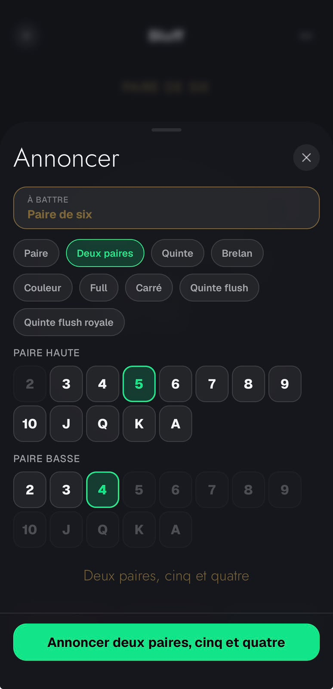
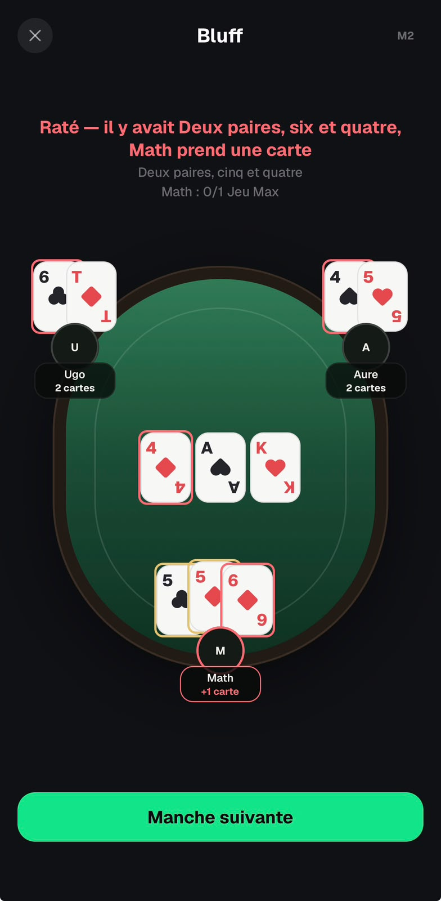

# Bluff — Feedback Mathieu (26–27 août 2026)

Source : WhatsApp, messages du 26/08 22:06 → 22:22 et 27/08 06:03.

## UI

1. **Chevauchement en haut** — petit souci d'affichage entre le nom du jeu et l'action en haut de l'écran.

2. **Phrase du bas** — d'abord proposé de la reformuler (« Valide le nombre de cartes du board avant de regarder tes cartes » / « Valide le board avant de regarder tes cartes », bouton « Valider le board »), puis **décision finale (27/08)** : supprimer carrément la phrase « validé le milieu avant de regarder tes cartes ». Tant que le joueur n'a pas validé, il n'a simplement pas accès à ses cartes. Ça rapproche le bouton « Révéler le board » de « cartes cachées au centre » et allège la page.
   

3. **Annonce deux paires : ordre inversé** — pour annoncer 2 paires c'est galère ; il faudrait sélectionner d'abord la paire basse puis la paire haute.
   

4. **Message « Jeu Max »** — la phrase du haut dit « il y avait 2 paires 5 et 6 » (vrai), mais il vaut mieux annoncer le jeu max réel : « le jeu max était full aux 5 par les 6 » (dans cet exemple).
   

## Règles du jeu

5. **Contrainte d'annonce minimum imposée par le board** ⚠️ règle manquante :
   - Board 4-8-Q : impossible d'annoncer « quinte au 7 » — s'il y a un 8 visible, quinte au 7 implique quinte au 8. L'annonce doit intégrer les cartes connues du board.
   - Board 2-2-2-7-8 : le board fait déjà brelan de 2 → toute annonce doit être strictement plus forte que brelan de 2 (impossible d'annoncer « paire de 7 »).
   - Board 5-5-2 : le board fait déjà paire de 5 → avec 88 en main, l'annonce minimum est « deux paires 5 et 8 », pas « paire de 8 ».
   En résumé : l'annonce minimum autorisée = la main faite par le board seul, et les annonces proposées doivent être cohérentes avec les cartes visibles.

## Plus tard

6. **Variante** — commencer avec 2 cartes / élimination après 5 cartes, ou commencer avec 1 carte / élimination après 4 cartes.
