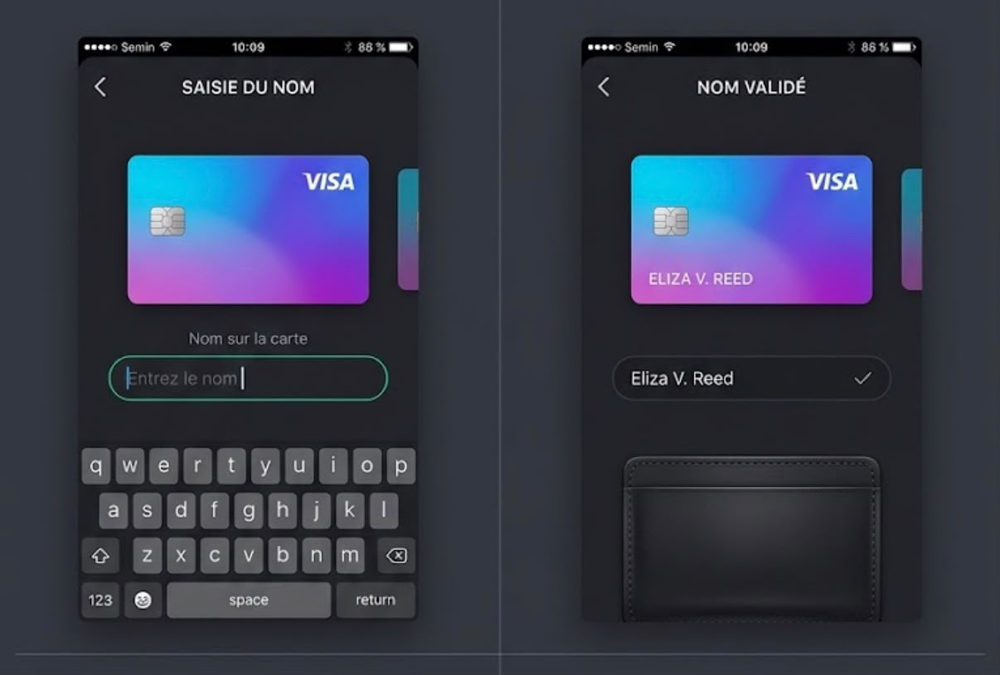
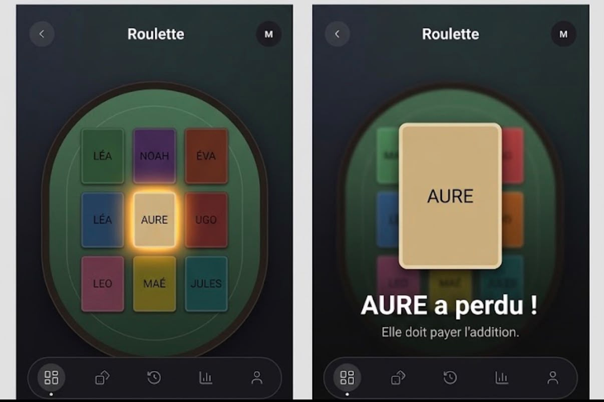
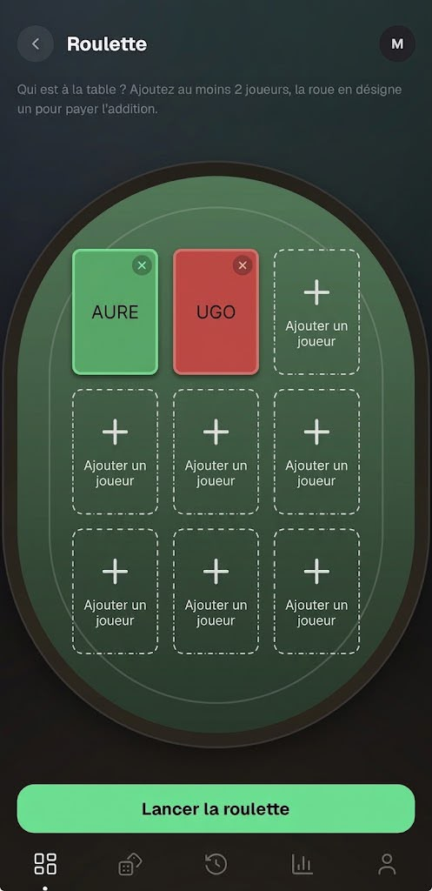

# Flip / Roulette — Feedback Mathieu (26 août 2026)

Source : WhatsApp, messages du 26/08 22:31 → 23:28.

1. **Remplacer la roue de la roulette par un système de cartes** ⚠️ refonte :
   - La roue qui tourne « rend vraiment pas bien » : on ne voit pas les noms, ça va trop vite, on n'a pas le temps de vibrer.
   - Idée : chaque participant = une carte, toutes disposées sur une table de poker. Une animation de lumière passe sous chaque carte de manière aléatoire, et quand la lumière s'arrête, la carte éclairée a perdu.
   - Références visuelles envoyées : mixte entre la photo 1 et la photo 2 — les cartes de la photo 2 sont trop détaillées mais son système de menu est bien (on slide à droite pour ajouter des cartes) ; la photo 1 permet de voir toutes les cartes mais ses cartes sont moches.
   
   

2. **Idée de menu commun** — pour Flip, OFC et Bluff, un menu qui garde la même DA avec la table (« moins de travail je pense »).
   

3. **Description Flip qui dépasse** — la description de Flip (comme celle d'OFC) déborde de sa carte sur le Dashboard (voir ofc/FEEDBACK.md et general/).

---

## Round 2 (2026-08-28, Remy)

- Setup flip/bluff/OFC : une table verticale dont les SIÈGES sont le roster — cercles cerclés d'or sur le rail avec un « + » vert ; taper un siège ouvre une bulle « Entrer nom… / Valider » ancrée au siège (avec suggestions des joueurs connus) ; feutre décoré de 2 cartes face cachée + jeton D. (Mockup fourni dans la conversation du 28/08, non archivé ici.)
- Setup roulette : la grille 3×3 de cartes sur le feutre (mockup 00000980) — cartes colorées à bord clair + ⊗, slots libres en pointillés « + Ajouter un joueur », même bulle d'ajout. Cap à 9 joueurs.
- Tirage roulette : la carte éclairée devient entièrement crème avec halo doré ; à l'arrêt, la carte du perdant grossit jusqu'au centre, puis « {{name}} a perdu ! / paie l'addition » + Relancer (l'ancienne carte résultat sombre et les confettis sont supprimés).
