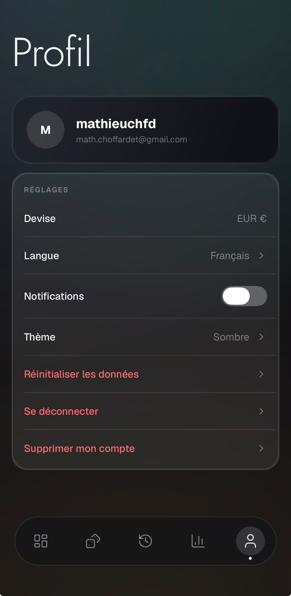
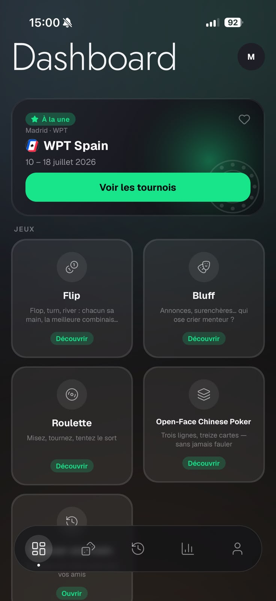
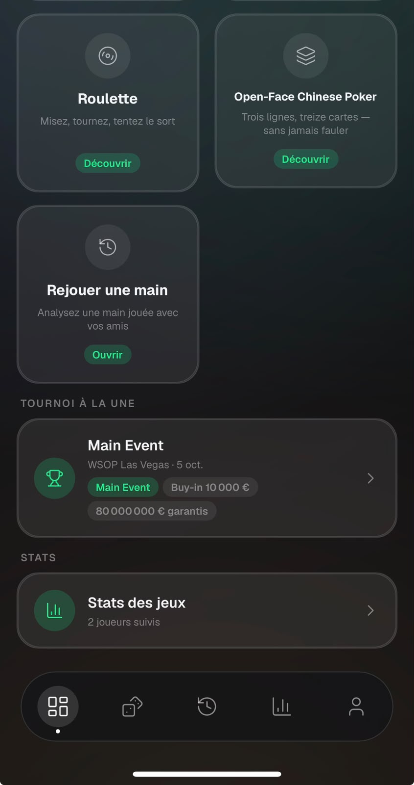

# Général / Dashboard — Feedback Mathieu (25–27 août 2026)

Source : WhatsApp, messages du 25/08 22:23 → 27/08 05:59.

1. **Confirmation à la fermeture d'un jeu** *(25/08, validé par Remy le 26/08)* — quand on clique sur la croix en haut à gauche d'un jeu, ça termine la partie en cours sans prévenir → ajouter un bouton de confirmation. (La reprise de partie type « barbu de Thibault » a été écartée : trop d'écrans pour des parties courtes.)

2. **Réglage Devise €** — à supprimer du Profil ? (probablement inutile depuis le pivot game-stats).
   

3. **Nom « Dashboard »** — toujours pertinent ?
   

4. **Placement du Replayer sur le Dashboard** — il ne doit pas être avec les jeux mais remplacer le bloc « Tournoi à la Une », même taille que ce carré, avec une couleur différente et bien voyante.
   

5. **Menu principal** :
   - « OFC » à la place de « Open Face Chinese Poker ».
   - Corriger les descriptions d'OFC et de Flip qui dépassent.
   - Ajouter les jeux « Poker » et « Blackjack » avec la mention « en attente » à côté.

6. **Ajout d'un ami à l'app** — Mathieu demande si son pote a été ajouté ; Remy attendait son go. (Action côté humain, pas côté code.)
