# Replayer — Feedback Mathieu (26–27 août 2026)

Source : WhatsApp, messages du 26/08 21:19 → 23:40.

## Saisie de la main (HH form)

1. **Ouvrir directement le menu de position** — le menu de choix de la position devrait être ouvert d'office, sans devoir cliquer sur « BTN ». C'est la première chose qu'on règle après le nombre de joueurs.
   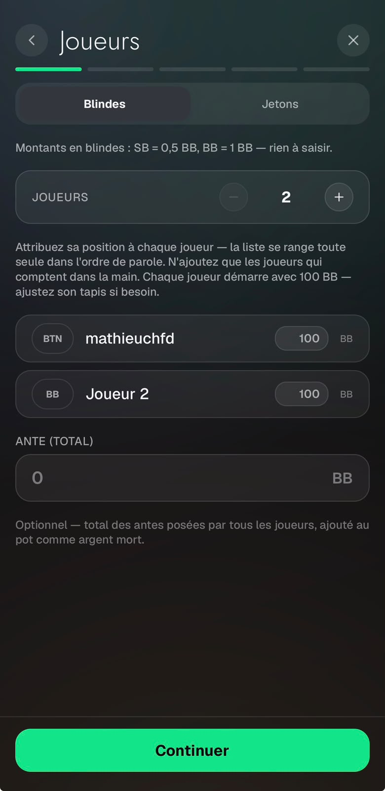

2. **♠️♣️ invisibles en mode sombre** — les symboles pique/trèfle à gauche ne se voient pas en thème sombre.
   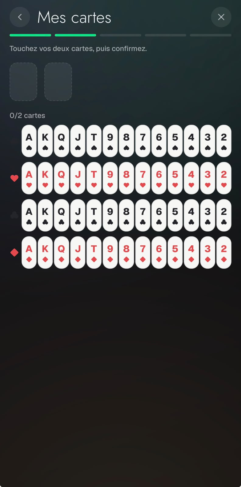

3. **Bouton ALL IN** — le vert fait bizarre (même couleur que les autres actions ?) → prévoir une autre couleur. Et pas besoin d'afficher le montant du all-in à ce moment-là.
   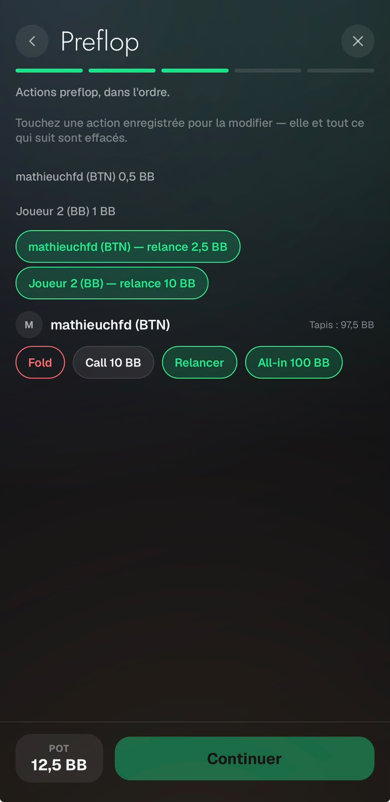

4. **Saisie de mise cassée à la turn et à la river** — on ne voit pas ce qu'on écrit et on ne peut pas valider le montant de la mise (clavier qui masque l'input ?).
   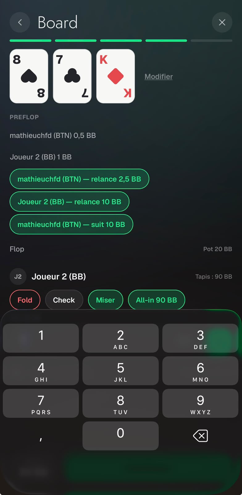

5. **Ante par défaut = 1** — pré-remplir l'ante à 1 (c'est quasi toujours 1 BB).
   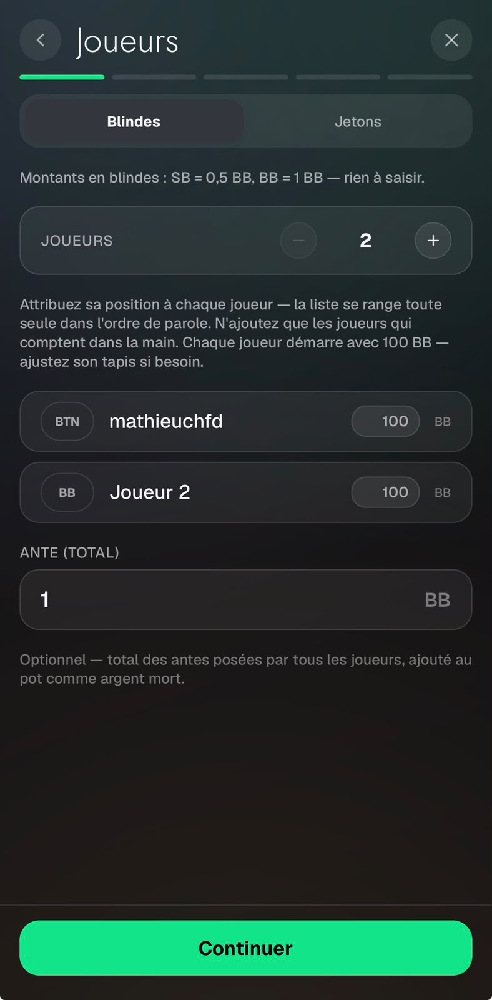

6. **Page showdown scrollée en bas** — quand on arrive sur la page showdown, on est directement en bas de la page, il faut scroller vers le haut pour voir le reste.
   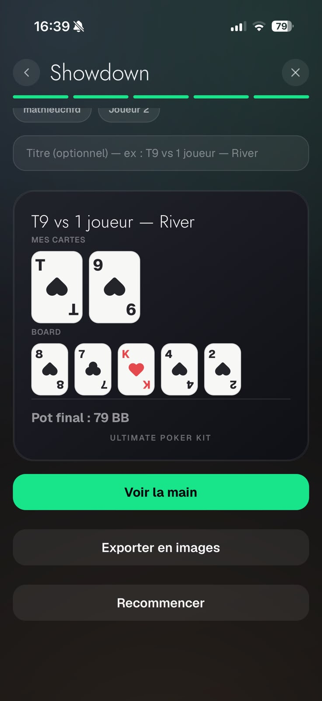

## Replay / rendu vidéo

7. **Titres masqués par les cartes face cachée de J2** — les 2 cartes face cachée derrière « Joueur 2 » recouvrent le titre (RIVER…). Proposition : les supprimer.
   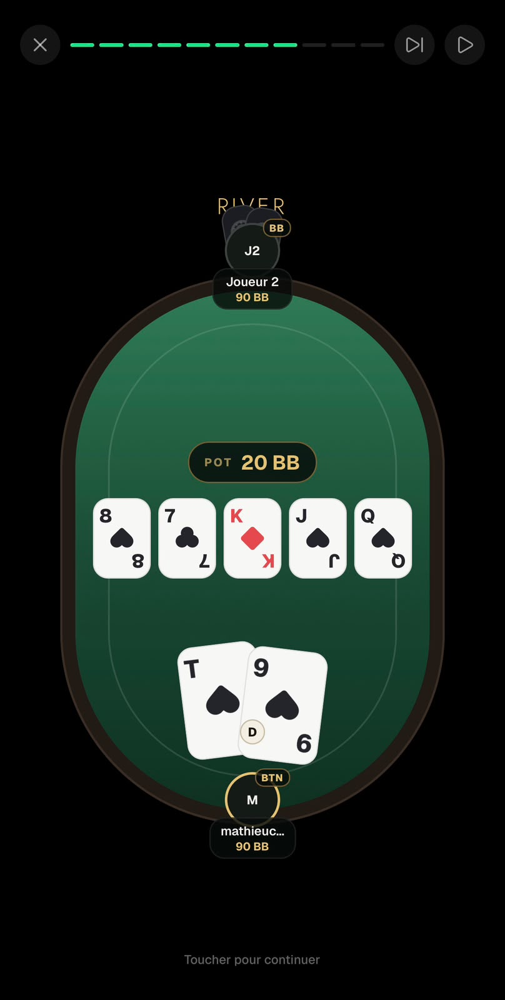

8. **Bug d'affichage au lancement** — la position BTN n'est pas affichée et un bout de Joueur 2 disparaît au début ; tout réapparaît au premier tap. (Le bug se corrige quand on screenshot, donc pas visible sur la photo.)
   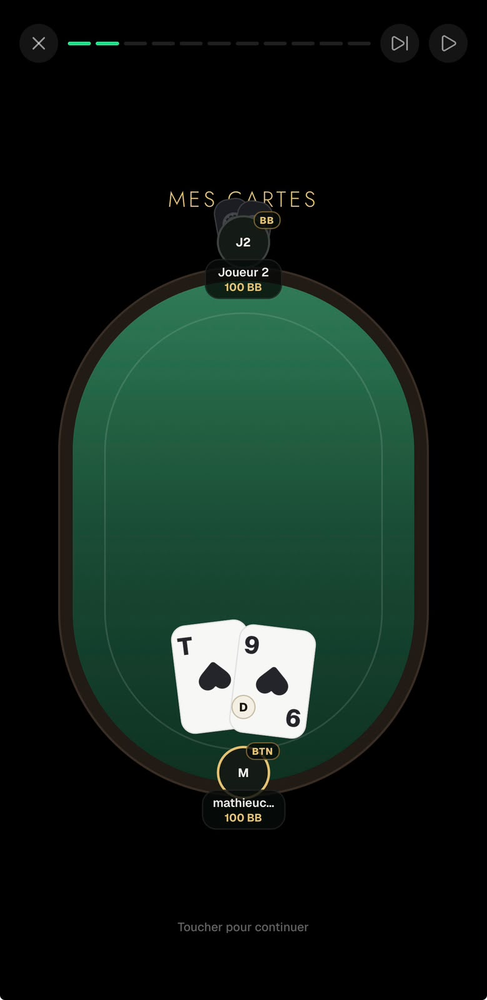

9. **Cartes de l'adversaire quasi invisibles** au showdown.
   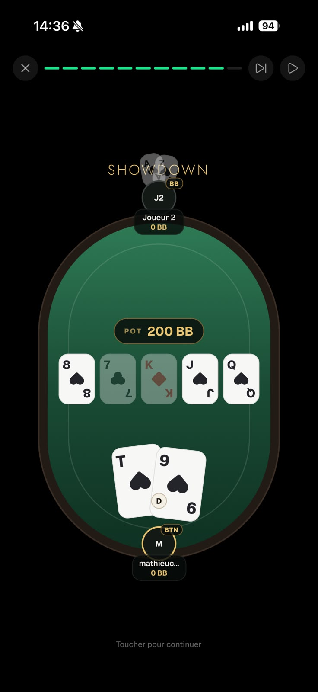

10. **Bouton D (dealer) sur la table** — pas nécessaire vu que les positions sont déjà indiquées (avis « pas sûr »).

11. **Cartes héros trop grosses et trop centrées** — elles devraient être petites, à gauche de l'avatar « M / mathieuchfd », puis s'agrandir au showdown en fin de main — avec la main adverse en grand aussi.

12. **Flop aligné à gauche** — le flop peut directement être à gauche plutôt que centré.
    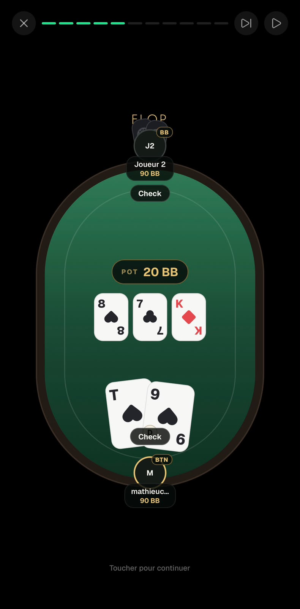

13. **Mise en page / déroulé du replay** :
    - Le titre (PREFLOP/FLOP/…) doit rester en haut tout du long ; les actions s'écrivent au-dessus du pot.
    - « Mes cartes » : faut-il vraiment un clic entier pour cette étape, ou peut-elle s'afficher dès le lancement ?
    - Preflop affiche directement les actions, mais flop/turn/river demandent 2 clics (1 pour la carte, 1 pour les actions) → 1 clic pour carte + actions devrait suffire.
    - Les actions s'enchaînent trop vite : laisser un petit délai entre l'action et la réponse à l'action.
    - Le showdown est à améliorer : cartes adverses mal visibles, nos cartes ne bougent pas alors qu'on a gagné (lié au point 11).
    - En dessous du board : écrire « Ultimate Poker Kit ».
    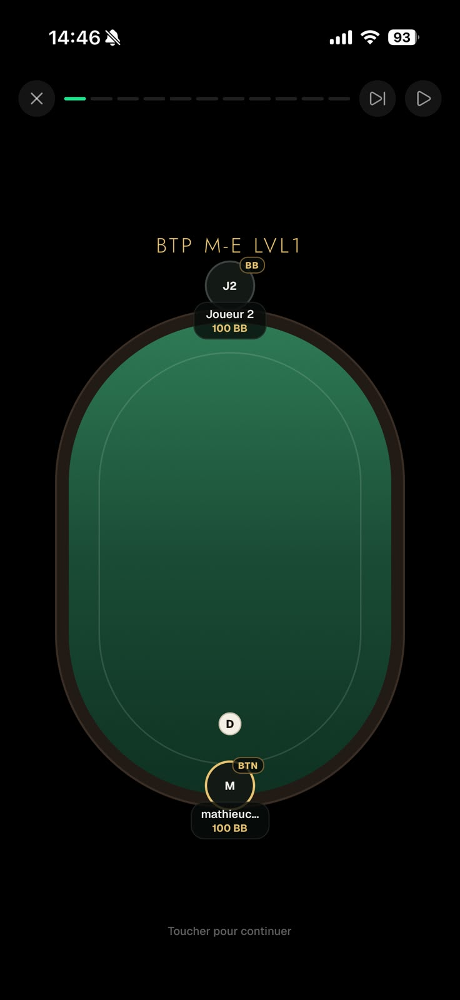

14. **Export = vidéo, pas des images** ⚠️ gros point — le système d'enregistrement actuel sauvegarde les étapes en images une par une (11 images par HH). Il faut enregistrer une **vidéo** publiable en story, c'est tout le concept.

## Placement dans l'app (voir aussi general/)

15. Le Replayer ne doit pas être rangé avec les jeux mais remplacer le bloc « Tournoi à la Une » sur le Dashboard, même taille que ce carré, dans une couleur différente et bien voyante.
