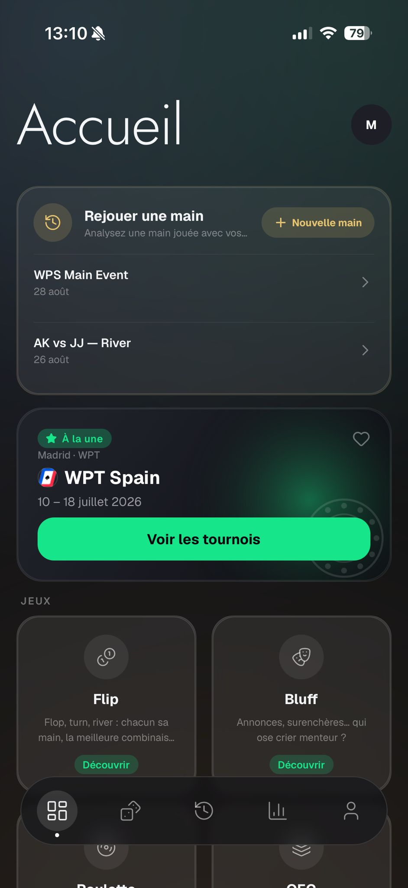
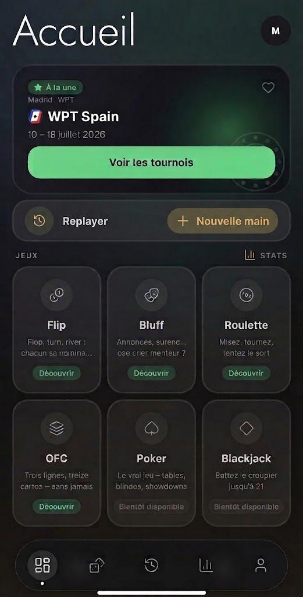
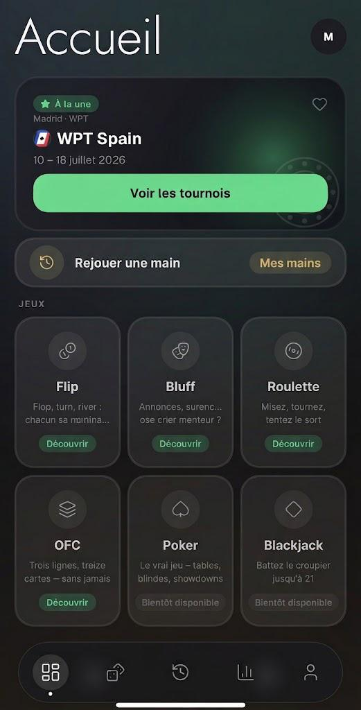
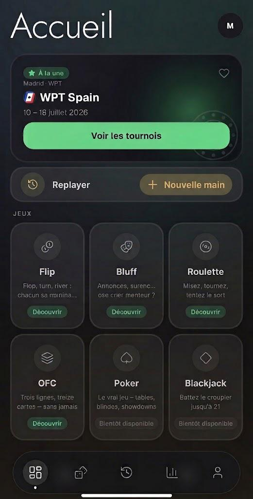
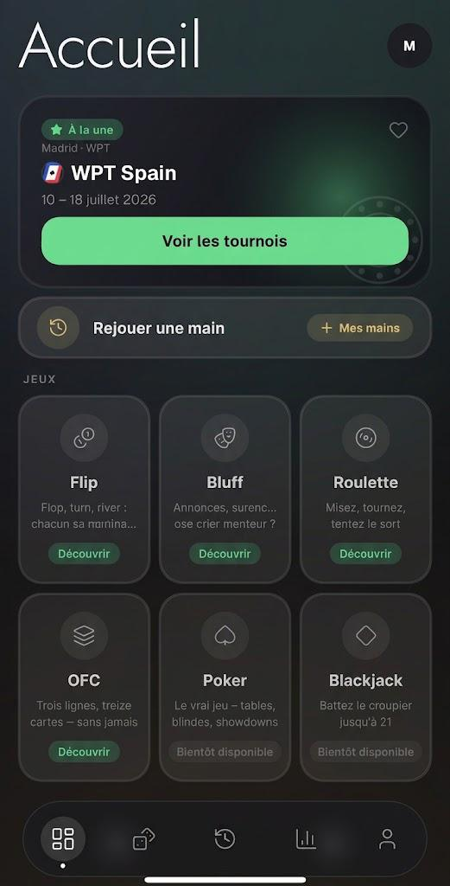

# Accueil — Feedback Mathieu (28 août 2026)

Source : WhatsApp, messages du 28/08 20:15 → 23:55, avec une discussion aller-retour avec Rémy sur
les règles de design.

> « Dans l'idée faut vraiment qu'on puisse voir dès qu'on ouvre l'app, encart de pub en haut, un
> bouton pour direct accéder au replayer et les jeux, quitte à c'que l'encart de pub soit plus petit »

Ordre actuel dans `app/(tabs)/index.tsx` : Replayer → À la une → Jeux → Tournoi à la une → Stats.

---

## 1. Réordonner

> « pour moi je remets l'encart À la une au dessus de replayer »

`FestivalHeroCard` (« À la une ») → Replayer → Jeux.

## 2. Supprimer « Tournoi à la une »

> « Supprimer « tournoi à la une » »

Section `app/(tabs)/index.tsx:205-239`. Retirer `dashboard.json sections.featuredTournament` des deux
langues si rien d'autre ne l'utilise (le test de parité attrapera une suppression unilatérale). Les
memos `featuredTournament` / `featuredTournamentFestival` (l.96-106) partent avec.

## 3. Un lien STATS sur la ligne JEUX

> « On pourrait même mettre un bouton stats à côté de Jeux, comme ça tout le menu tient en un écran,
> dès que tu lances l'app »

Remplace la carte Quick stats du bas par un lien texte STATS sur la ligne du `SectionLabel` JEUX.

## 4. Le bloc Replayer est trop haut

> « Pour moi replayer est trop gros, comme on a dit, ça reste de base une app de jeu, et quand on
> ouvre l'app d'entrée, on doit scroll pour voir les jeux »
> « j'aime pas le fait de voir les 2 dernières mains »

Dans `src/components/dashboard/ReplayerHeroCard.tsx`, chaque ligne de main est
`paddingVertical: spacing.md` + `marginTop: spacing.md` + un filet, posé sur un header de 38pt : avec
deux lignes la carte fait environ le double de la carte tournoi.

**Décision** : supprimer complètement les lignes de mains — elles doublonnent l'onglet Replayer, à un
tap. `lastHands` (`index.tsx:54`) devient inutilisé.

## 5. Deux boutons côte à côte

> Mathieu : « en cliquant sur Rejouer une main / Analyse une main jouée… ça amène sur la création
> d'une nouvelle main, et à la place du bouton « nouvelle main » il s'appelle Mes mains pour accéder
> à l'historique des mains déjà créées »
> Rémy : « le bouton rejouer / mes mains est pas ouf niveau ux il respecte peu de convention. Mes
> mains c'est un tag et pas un bouton ici, il faut respecter la hiérarchie des boutons / infos »
> Rémy : « ta hiérarchie est pas bonne, il y a rien qui montre que c'est clickable »

**Décision** : plutôt que de rendre le corps de la carte cliquable, la carte porte son titre/sous-titre
et **une paire de boutons côte à côte — « Nouvelle main » (primaire) et « Mes mains » (secondaire)** —
assez proches pour se lire comme une même fonctionnalité, tout en gardant une hiérarchie de boutons
propre. Plus rien n'est cliquable de façon ambiguë, et les deux vraies actions sont de vrais boutons.

## 6. Densité des tuiles

> Mathieu : « les 6 ensemble j'trouve pas [que ça charge], après on peut faire le test et voir »
> Rémy : « Je partirais sur deux par lignes en jeux plutôt, là ça fait bcp d'info je trouve à l'écran »

**Décision** : garder `GameTile` à `width: '48%'` (2 par ligne) mais réduire la tuile — description sur
une ligne, disque d'icône plus petit — pour que les six tiennent dans environ deux tiers d'écran. Les
tuiles sont du JSX en dur (`index.tsx:163-200`) et sont dupliquées sur l'onglet Degen
(`app/(tabs)/degen.tsx`) : en profiter pour extraire la liste dans un tableau partagé.

---

## Note

Il n'existe **pas** de primitive `Button` partagée dans le code — les styles primaire/secondaire sont
redéclarés écran par écran avec une couleur de label `#0A0A0F` en dur (`hand-replayer/index.tsx`,
`view.tsx`, `play.tsx`). On n'en extrait pas une maintenant ; les deux boutons ci-dessus déclarent
leurs styles localement comme partout ailleurs.
