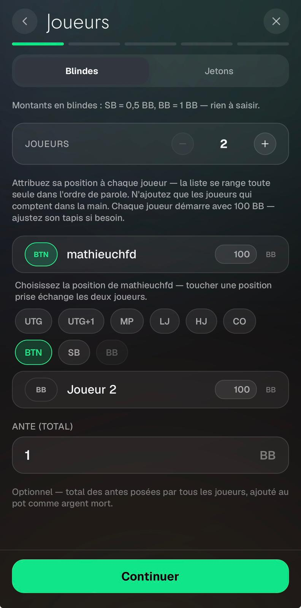
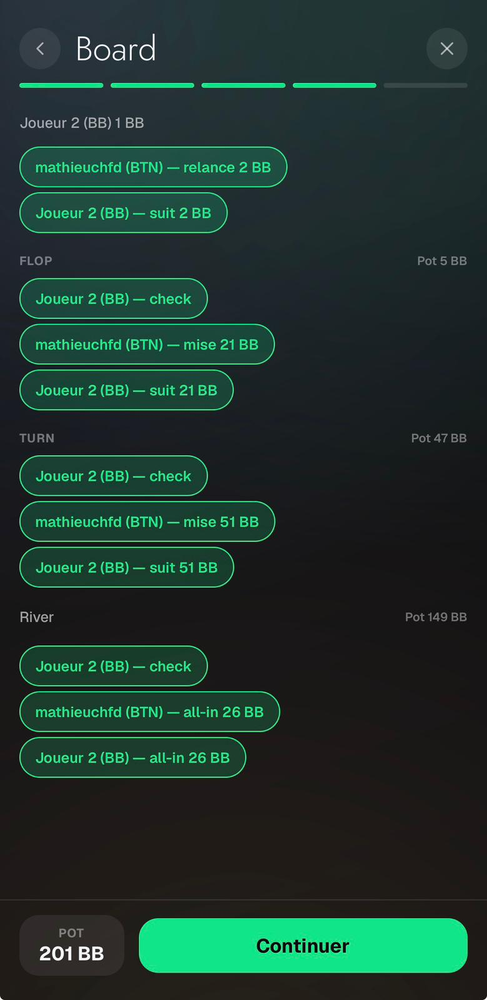
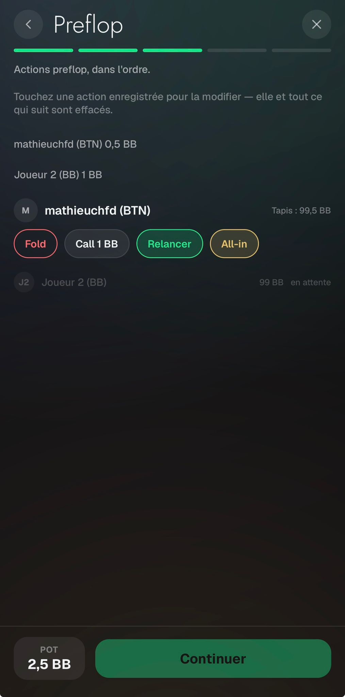
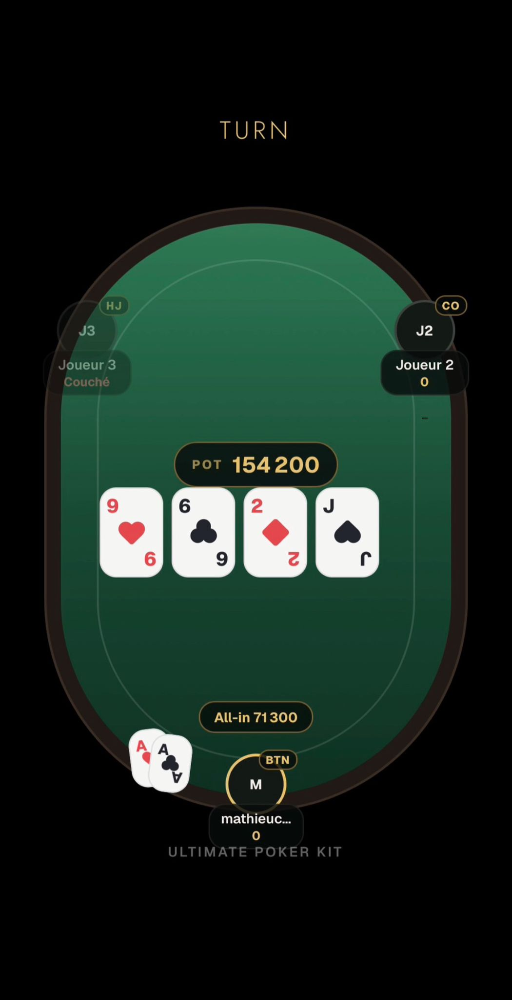

# Replayer — Feedback Mathieu (28–29 août 2026)

Source : WhatsApp, messages du 28/08 19:47 → 29/08 00:05.

> « Franchement le replayer est devenu génial à utiliser » — mais c'est aussi le seul produit du
> batch avec de vrais défauts fonctionnels.

---

## 1. Ordre des actions dans la vidéo ⚠️ le vrai bug

> « Par exemple sur cette vidéo, voilà les soucis :
> - au flop : tu as anticipé trop tôt le fold de joueur 1, il manque le fait que les 2 joueurs check
>   check, puis je mise 5.100, il passe, et l'autre joueur me raise (le stack de joueur 2 et moi sont
>   modifiés trop tôt, avant que j'ai misé 5.100 et qu'il m'ai raise 11k)
> - pareil turn nos stacks sont déjà à 0 alors qu'il n'a pas encore misé all in et que j'ai pas
>   encore call
> - preflop […] tu affiches le pot avant les mises et il manque des actions : il faut d'abord que tu
>   mettes l'action de joueur 1 mise 2k puis call 2k de joueur 2 puis 3bet 7.2k moi, call, call PUIS
>   tu affiches le POT : 23600 »

Vidéo : `00001024-VIDEO-2026-08-28-19-55-39.mp4`

Trois symptômes, une seule cause, dans `app/hand-replayer/play.tsx` :

- `buildBeats` (l.85) émet **un beat par street** portant toute la liste d'actions.
- `revealedContribs` (l.544-562) intègre **le beat entier** dès que `index` s'y pose : `potSoFar` et
  le `remaining = startingStack - committedFor(id)` de chaque siège sautent à leur valeur de fin de
  street avant qu'une seule bulle n'ait été animée.
- `bubbles` (l.566-569) est une `Map` clefée par **`playerId`** : seule la *dernière* action de chaque
  joueur sur la street survit. Un check → mise → suivi perd le check ; un `post` préflop est écrasé
  par la relance du même joueur.

**Décision** : garder un tap par street (rythme voulu, commit `386c81e`) et ajouter un **curseur
d'actions à l'intérieur du beat**. Un état `revealedActions` avance sur un `setTimeout` de
`ACTION_STAGGER`, démarré après `cardLeadMs(beat)`, et pilote `revealedContribs`, les bulles et la
pastille POT. Les bulles sont clefées par `` `${playerId}-${orderIdx}` `` pour que les actions répétées
aient chacune la leur. Le pot monte alors action par action et atteint son total en dernier — la
séquence qu'il décrit.

Deux pièges :

- **L'export partage l'horloge.** `runExport` (l.306-413) capture pendant
  `animWindowMsFor(beat) × EXPORT_SLOWMO` de temps réel en redivisant les PTS : le timeout du curseur
  doit porter le même facteur `EXPORT_SLOWMO` tant que `exportState === 'exporting'`, sinon la vidéo
  joue les actions 3× trop vite. `animWindowMsFor` budgète déjà `(actions.length - 1) × ACTION_STAGGER`,
  la fenêtre est donc de la bonne longueur.
- **Les `post` ne sont pas animés** en bulles mais comptent dans le pot dès la première image du
  préflop — il a dit lui-même que ce n'était pas nécessaire de les montrer (29/08 00:05).

---

## 2. Le préflop met trop de temps à démarrer

> « preflop la vidéo met trop de temps à démarrer je trouve »

Le beat d'intro coûte `animWindowMsFor = 500` + `holdMsFor = 900` avant que le préflop ne commence.
**Décision** : hold d'intro ramené à ~400ms et `cardLeadMs` à 0 pour le préflop, pour que la première
action s'écrive dès que les sièges sont posés. Environ une seconde gagnée sur chaque vidéo.

---

## 3. La vidéo crashe au milieu (écran blanc)

> « Et la vidéo a bug la vidéo crash au milieu (écran blanc) »

**Non reproduit** — à valider sur device avant de le déclarer corrigé. Le suspect est `runExport`
(l.306-413) : une boucle `while` qui enchaîne `await captureRef(tableShotRef, …)` en 1080×1920 sans
plafond ni respiration, empile `appendFrame` dans une `chain` sans l'attendre, et appelle
`releaseCapture(uri)` dans le `finally` alors que l'encodeur peut encore être en train de décoder ce
fichier.

**Décision** : ne pas toucher au rythme de capture (ça changerait le rendu de la vidéo), corriger
l'ordre et les bornes :

1. Backpressure — `await` la chaîne d'append toutes les N frames pour borner les JPEG en vol.
2. Ne libérer chaque capture qu'une fois son `appendFrame` résolu.
3. Protéger `finish()` contre une session sans aucune frame.
4. Logguer nombre de frames / durée / pic en vol pour que la prochaine repro soit diagnosticable.

Puis une main longue sur device, **les deux plateformes** — l'export vidéo Android n'a jamais été testé.

---

## 4. Double enregistrement à la fin de l'export

> « La vidéo s'enregistre déjà dans mes photos, puis ça me repropose soit enregistré dans photos soit
> partager sur WhatsApp, Insta, etc, c'est normal ? J'avoue que le système me paraît bizarre »

`play.tsx:397-404` appelle `MediaLibrary.saveToLibraryAsync` puis immédiatement `Sharing.shareAsync` :
la vidéo est déjà dans Photos quand iOS propose à nouveau « Enregistrer dans Photos ».

**Décision** : supprimer l'enregistrement automatique — la feuille de partage le contient déjà.

Bénéfice collatéral : `MediaLibrary.requestPermissionsAsync(true)` en tête de `runExport` devient
inutile (`expo-sharing` partage une URI `file://` sans permission média), donc la permission d'écriture
peut sortir du manifeste — vérifier `app.json`, le batch précédent avait déjà élagué les permissions
média pour le Play Store.

Contrepartie assumée : si l'utilisateur ferme la feuille, la vidéo est perdue. C'est le comportement
conventionnel, et c'est ce qui lève sa confusion.

---

## 5. Ante — un toggle On/Off

> « Ante : j'me suis mal exprimé, met juste un toggle pour ante si il y en a ou non, un genre de Ante
> On/Off, et si il y en a ça sera forcément égal au montant de la bb pas besoin de mettre de montant »

`anteInput` (`app/hand-replayer/index.tsx` l.183, défaut `'1'`) est un `AmountInput` intitulé
« ANTE (TOTAL) ».

**Décision** : un interrupteur On/Off qui met l'ante à 1 BB, plus une petite affordance « modifier »
révélant le champ existant pour une ante non-BB. `HandHistory.ante` reste un nombre : les mains
sauvegardées, `computePots` et `livePot` ne bougent pas.

---

## 6. Rééditer les cartes du board street par street

> « À côté de Flop : mettre les 3 cartes du flop pour que je puisse re cliquer dessus et les modifier
> si je me suis trompé. Pareil à côté de turn et river »

`renderBoardStep` (l.655-719) restreint `editingBoard` au `boardPhase` courant, et un effet
(l.424-432) avance le curseur dès que les mises d'une street sont closes — depuis la turn il n'y a
donc plus aucun moyen de rouvrir la grille du flop.

**Décision** : afficher les cartes choisies **à côté de chaque en-tête de street** dans le récap,
tapables pour rouvrir `CardGrid` sur cette street. `disabledCardsFor` (l.321) gère déjà les collisions,
à relancer après édition. Les streets suivantes gardent leurs cartes — ce sont des emplacements
indépendants.

---

## 7. « MathieuChfd (BTN) 0.5BB » — pas un bug

> « c'est pas moi qui paye 0.5BB, c'est le joueur qui est en SB tout le temps qui paye au minimum
> 0.5BB […] si il paye une relance à 2BB, il paye pas 2BB + 0.5BB, il paye juste 1.5BB en plus »

**Le moteur a raison, deux fois.**

1. `computeBlindPosting` (`src/lib/handPositions.ts:41-54`) détecte le heads-up (`players.length === 2`
   avec BTN + BB) et fait payer la petite blinde au bouton. C'est la règle du poker : en heads-up le
   bouton **est** la SB.
2. Les montants sont déjà des totaux, pas des incréments :
   `round.contributions[a.playerId] = a.amount` (`handEngine.ts:145`) écrase. Son propre récap le
   confirme : relance 2 BB + suivi 2 BB + ante 1 BB = pot 5 BB.

Ce qui manque, c'est que **rien à l'écran ne dit quelle blinde a été payée**. Correctifs d'affichage
uniquement :

- Les lignes de post (`index.tsx:618-628`) et les bulles de replay affichent `nom (position) montant` —
  y ajouter la blinde (SB / BB). Nouvelles clés dans le namespace `replayer` ; les positions restent
  non traduites (glossaire).
- Afficher **`BTN/SB`** sur le badge de position quand la branche heads-up se déclenche, pour que le
  bouton payant 0,5 BB se lise comme intentionnel.
- Le champ de relance de `PlayerActionRow` doit dire que c'est un **total** (« relance à »), pas un
  ajout. `firstRaiseDefault = 2 * bigBlindValue` veut bien dire « relance *à* 2 BB ».

**À lui répondre** — sinon il le re-signalera.

---

## 8. Retouches visuelles de la table

> « - Ultimate Poker Kit juste en dessous du board (des 5 cartes au milieu)
> - le pot me paraît un peu collé au board
> - les cartes de Mathieu sont un peu loin de lui
> - Je laisserai le titre de la main au dessus de la table tout le long de la main
> - Je mettrai les textes d'actions : Preflop, flop, turn etc au dessus de POT : xxxxx
> - j'élargirai un peu la table en dessous et au dessus »

Les cinq points sont retenus :

- **Le titre de la main reste au-dessus de la table toute la main.** `renderCaption` (l.662) alterne
  aujourd'hui entre titre et nom de street, et est re-clefé à chaque beat (`key={caption-${index}}`).
  À scinder : le titre devient une ligne statique au-dessus de la table.
- **Dans le feutre, dans cet ordre** : nom de street → pastille POT → board → wordmark.
- **Espacement du pot** : `styles.potPill` est trop près du board.
- **Cartes du héros rapprochées** : réduire l'offset de `styles.heroCardsSide` (l.783-794).
- **Table élargie** en haut et en bas — voir [shared-table/](../shared-table/FEEDBACK.md).

