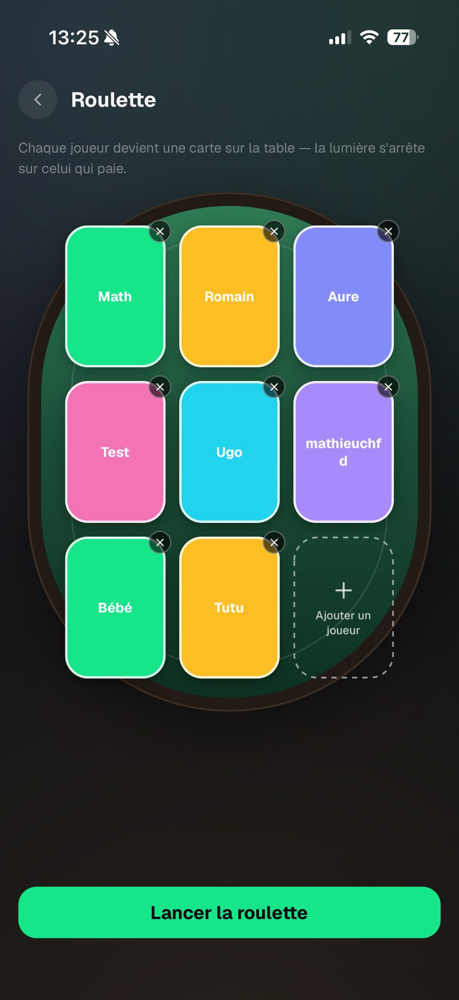

# Roulette — Feedback Mathieu (28 août 2026)

Source : WhatsApp, message du 28/08 20:29.

> « La roulette, vraiment stylé, à part la table un peu plus large rien à dire c'est vraiment cool à
> voir ! »

---

## 1. Pattern de lumière — on garde l'aléatoire

> « Est-ce que le fait de faire suivre la lumière un pattern logique plutôt qu'aléatoire, partant de
> la première carte à la dernière en ralentissant petit à petit est pas un peu plus stressant et
> excitant que le système aléatoire ? »

**Décision : non, on garde le tirage aléatoire.** `computeHopSchedule`
(`src/components/degen/RouletteCardTable.tsx:51-91`) ne bouge pas — y compris le cas particulier
`count === 2` (alternance) et les 1 à 3 derniers sauts au ralenti. L'imprévisibilité est l'intention
de design consignée dans le commentaire du fichier.

## 2. Texture sur les cartes

> « moyen de rajouter un peu de texture ou quoi sur les cartes, j'm'y connais pas en design mais
> j'sais pas ça me paraît bizarre (logo UPK sur chaque carte ?) »

Les `PlayerNameCard` colorées sont des aplats. **Décision** : un composant partagé `CardTexture` —
un monogramme UPK en faible opacité, répété en tuile sur la carte — utilisé par
`RouletteCardTable` (jeu) **et** `RouletteSetupBoard` (préparation), donc un seul changement pour les
deux écrans. Ça se lit comme un dos de carte plutôt qu'un rectangle de couleur, ce qui est exactement
ce qui le gênait.

## 3. Table plus large

Les deux tableaux reprennent les largeurs `PLAY_TABLE` / `SETUP_TABLE` —
voir [shared-table/](../shared-table/FEEDBACK.md).
