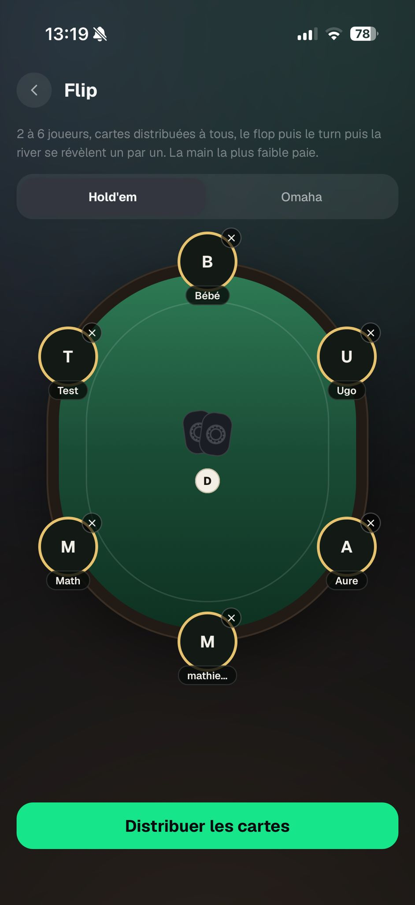
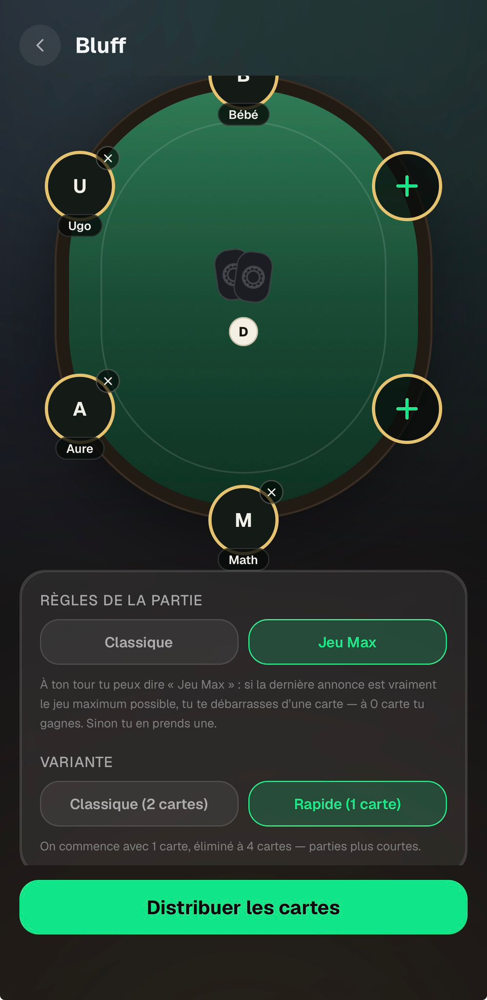
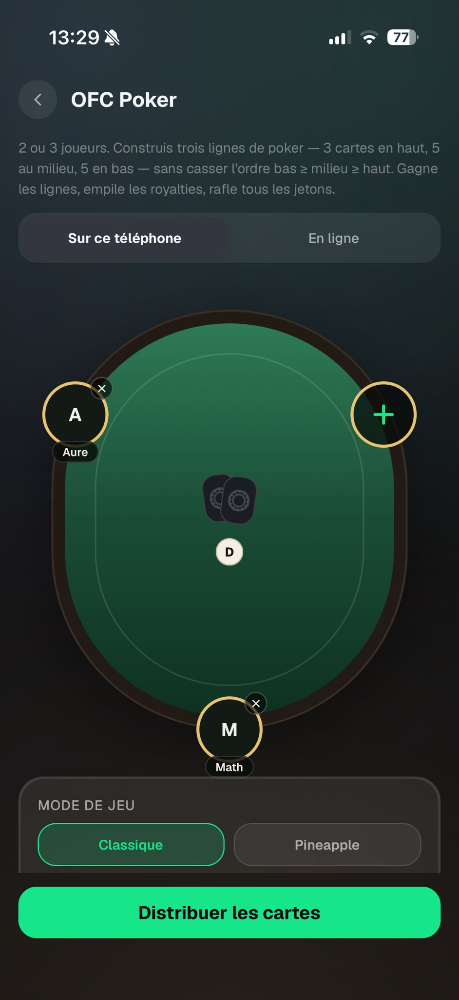
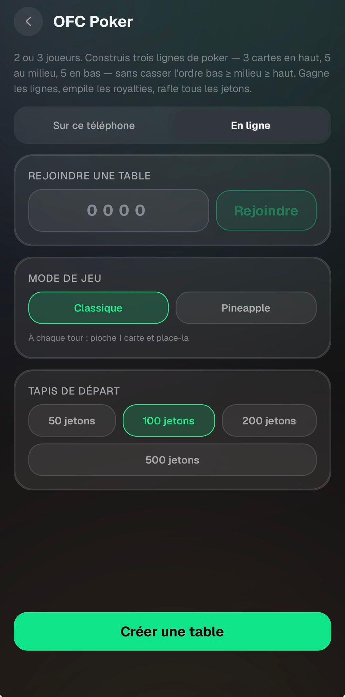

# Écrans de préparation — Feedback Mathieu (28 août 2026)

Source : WhatsApp, messages du 28/08 20:20 → 20:33.

Idée répétée quatre fois (Flip, Bluff solo, Bluff en ligne, OFC solo, OFC en ligne) — la Roulette est
explicitement exemptée (« pour chaque jeu sauf roulette »).

> « Je mettrais en gros le nom du jeu au milieu avec en dessous marqué Ultimate Poker Kit, à la place
> de la carte et du bouton »
> « Ou alors je mettrai les options de jeux au milieu de la table, ça serait bcp mieux non ? (Avec un
> petit bouton (!) à côté des options de jeux où tu cliques dessus pour voir le texte explicatif que
> tu as mis). Ça reste dans la DA d'une table un peu plus large »

Les cinq écrans partagent déjà `src/components/games/GameSetupScreen.tsx` (header + sous-titre + pile
de `SetupBlock` + CTA collant) et `src/components/games/SeatTableBoard.tsx` (la table des joueurs).
Le centre du feutre ne contient qu'un paquet de cartes et un bouton dealer décoratifs
(`styles.feltCenter`, `styles.deckPair`, `styles.dealerChip`) — c'est la place libre.

---

## 1. Un slot `center` sur `SeatTableBoard`

Remplace le paquet + le jeton dealer décoratifs par un slot passé par l'appelant.

## 2. Les options passent dans le feutre

Le `SegmentedControl` Hold'em/Omaha de Flip, les deux rangées de `ruleChip` du Bluff, les sélecteurs
variante + tapis de l'OFC quittent leurs `GlassCard` sous la table pour le centre du feutre, avec le
nom du jeu en grand en blanc au-dessus et « Ultimate Poker Kit » en dessous.

## 3. Libellés raccourcis

La largeur utile du feutre est `tableW - 2 × 38` (inset de la ligne de mise) ≈ 230pt. « Classique
(2 cartes) » / « Rapide (1 carte) » deviennent « Classique » / « Rapide ».

## 4. Le bouton (!) — bulle ancrée

Le détail retiré des libellés part derrière une petite icône `Info`. **Décision** : bulle ancrée,
sur le modèle de `src/components/games/SeatNameBubble.tsx` déjà construit pour ces tableaux (se
recadre dans le board, bascule au-dessus/en dessous, le parent gère le tap extérieur — voir
`SeatTableBoard` l.111-125).

Le texte existe déjà : `bluff.json setup.jeuMaxHint`, `setup.variantQuickHint`,
`ofc.json setup.variantClassicHint`, `setup.variantPineappleHint`. C'est un re-parentage, pas de la
copy nouvelle. À raccourcir si ça déborde de la bulle — c'est la contrainte de ce pattern.

## 5. La description du haut disparaît

> (27/08, toujours pas fait) « Changer la description de OFC et de flip qui dépasse »

Le `subtitle` est retiré de ces écrans ; un (!) à côté du titre du header ouvre le texte existant
(`games.json flip.subtitle`, `roulette.subtitle`, `bluff.json setup.subtitle`, `ofc.json setup.subtitle`).
Les clés restent, donc aucune divergence i18n. Ce (!)-là a besoin de plus de place qu'une bulle de
chip → `BottomSheet` pour le header, bulle ancrée pour le feutre.

La hauteur récupérée finance le passage de `tableH = min(tableW * 1.35, SCREEN_HEIGHT * 0.42)` à
environ `0.52`.

---

## 6. Lobbies en ligne — le feutre a trois états

> « OFC mode Multi : mettre aussi la table de jeu ? Avec les options au milieu de la table »
> « Et même chose pour bluff solo et multi »

Point soulevé par Rémy : le multi ne peut pas juste copier le solo, il y a une transition d'état que
le solo n'a pas — la table doit basculer et attendre les joueurs une fois la room créée, avec le code
au milieu.

Aujourd'hui `bluff/online.tsx` (l.202-274) et `ofc/online.tsx` (l.186-250) affichent un
`styles.codeBlock` doré plus une `GlassCard variant="dark"` listant les membres, les règles de l'hôte
en texte grisé non modifiable (`online.jeuMaxEnabled`, `online.variantQuick`).

Le centre du feutre devient **un slot à trois états** :

- **Avant création** — les options, comme en solo. CTA « Créer une table ».
- **Rejoindre** — le champ code à 4 chiffres + « Rejoindre » dans le feutre, puis l'état lobby.
- **Lobby** — le code en grand en doré, « Ultimate Poker Kit » en dessous, les règles choisies
  résumées sur une ligne non modifiable. Les sièges du rail deviennent vivants : siège occupé =
  le joueur connecté, siège vide = un placeholder « En attente… » qui pulse, à la place du bouton `+`.
  CTA collant : « Lancer la partie » pour l'hôte (actif au minimum de joueurs), « En attente de
  l'hôte… » pour les invités.

Le placeholder de siège et le CTA selon le rôle sont les seuls morceaux réellement nouveaux — le code,
la liste des membres et le résumé des règles existent déjà et ne font que déménager.

