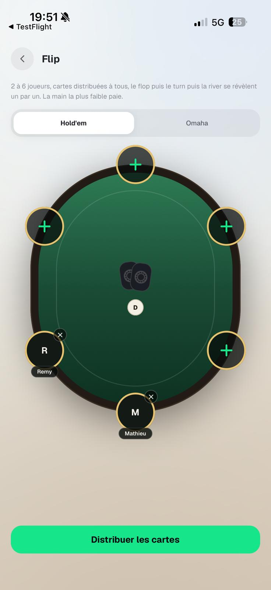
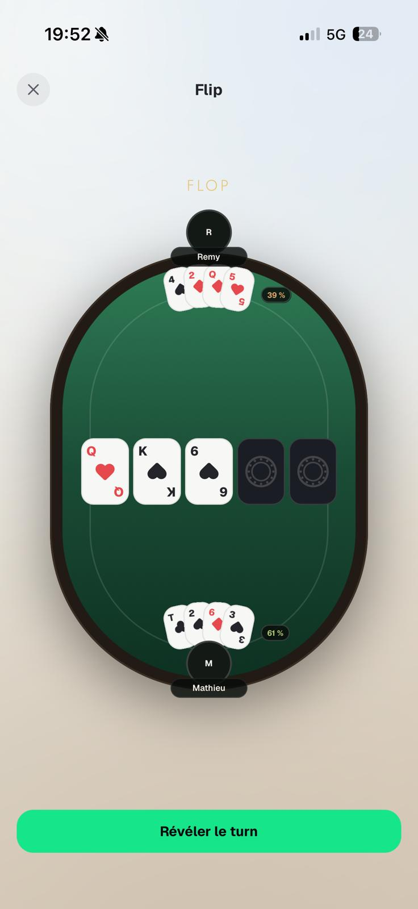
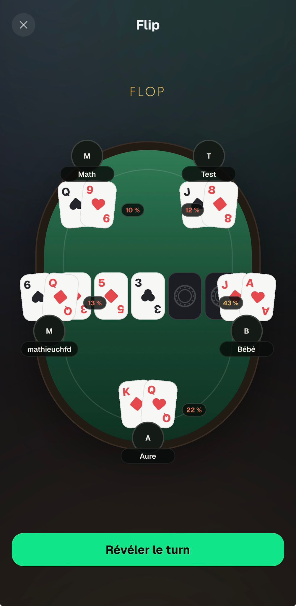

# Table de jeu partagée — Feedback Mathieu (28 août 2026)

Source : WhatsApp, messages du 28/08 19:49 → 19:53.

Mathieu formule ce retour à propos de Flip, puis le répète pour l'OFC, le Bluff et la Roulette.
C'est **un seul composant** : `SeatedTable` / `PokerTable`, partagé depuis le commit `03d8b3a` par
Flip, Bluff et le Replayer, et `SeatTableBoard` pour les écrans de préparation.

> « Globalement, c'est le cas sur tous les jeux, j'pense que tu gagnerais à ce que la table soit un
> peu plus grande en hauteur, quitte à sacrifier une partie des titrages en haut »
> « Non mais globalement c'est pas qu'un problème de taille de cartes, j'pense on gagnerai à ce que
> la table soit un peu plus large »

---

## 1. La table est trop étroite, partout

`SCREEN_WIDTH - 96` (plus une formule de hauteur `min(cap, max(floor, SCREEN_HEIGHT * ratio))`) est
copié-collé avec trois triplets différents dans quatre fichiers :

| Écran | Fichier | Dimensions |
|---|---|---|
| Flip | `app/games/flip/play.tsx` l.34-36 | `W-96`, `clamp(340, 0.48h, 470)` |
| Bluff solo | `app/games/bluff/play.tsx` l.35-38 | `W-96`, `clamp(320, 0.42h, 420)` |
| Bluff en ligne | `app/games/bluff/online.tsx` l.30-32 | idem, dupliqué |
| Replayer | `app/hand-replayer/play.tsx` l.44-49 | `W-96`, `clamp(350, 0.5h, 480)` |

Sur un écran de 393pt ça fait une table de 297pt, alors que le board de Flip mesure
5 × 46 + 4 × 4 = **246pt** : les cartes communes débordent de la ligne de mise (inset 38pt). Visible
dès 2 joueurs sur le screenshot de Rémy.

**Décision** : un module partagé `src/components/table/tableSize.ts` (`PLAY_TABLE`, `SETUP_TABLE`),
largeur `SCREEN_WIDTH - 40`, hauteur `clamp(380, 0.56h, 560)`. `squeezeX` passe de 0.92 à 0.86 dans
`SeatedTable.tsx` pour que les pods de 84pt restent à l'écran (débord ≈ 17pt pour 20pt de marge —
tolérance serrée, à vérifier sur le device le plus étroit). `WinCelebration` reçoit les mêmes
dimensions dans trois écrans, à déplacer en même temps.

---

## 2. Affichage cassé à 5 joueurs

> « FLIP : Affichage pas bon quand 5 joueurs »

Les cartes des joueurs de gauche et de droite recouvrent les cartes du board.

Ce n'est **pas** un problème de taille : `seatPoint(k, n, w, h)` (`src/components/hand/PokerTable.tsx`)
répartit les sièges régulièrement sur l'ellipse (`angle = π/2 + 2πk/n`). À **n = 5** les sièges 1 et 4
tombent à `y ≈ 0.65h`, juste sous la mi-hauteur, et `SeatedTable` fait alors monter leur éventail
(`cardsBelowPod = y < height * fanBelowAbove`) droit dans le board rendu au centre du feutre.
À **n = 4** c'est pire : les sièges sont exactement à `y = 0.5h`.

Élargir la table ne corrige pas ça.

**Décision** : table d'angles explicite par nombre de joueurs dans `PokerTable.tsx`, la répartition
régulière restant le fallback. Pour n = 5 : `[90, 145, 215, 325, 35]` → `y ≈ 0.79h / 0.21h / 0.21h /
0.79h`, dégagé du board des deux côtés. Un test unitaire vérifie que pour n = 2..9 aucun siège ne
tombe dans la bande du board — c'est la régression qui revient.

---

## 3. Cartes trop grosses

> Rémy : « Ah merde c'est que en Omaha les petites cartes »

`fanSizeFor(count)` dans `src/components/table/CardFan.tsx` ne réduit que sur le nombre de **cartes**
(`>= 4 → sm`), ce qui explique que l'Omaha ait eu ses petites cartes au commit `a125612` mais qu'une
table de Hold'em à 6 distribue encore des cartes `md` qui saturent le feutre.

**Décision** : `fanSizeFor(cardCount, seatCount)`, palier `sm` dès `seatCount >= 5`. Deux paliers, pas
de nouvelle géométrie. Séparément, la largeur des cartes du board de Flip est dérivée de `TABLE_W`
comme le fait déjà le Replayer (`BOARD_CARD_W`) au lieu du `size="md"` en dur.

---

## 4. « Ultimate Poker Kit » sous le board

> « Table : En dessous du flop, marquer : Ultimate Poker Kit »
> « Ultimate Poker Kit juste en dessous du board (des 5 cartes au milieu) »

Le wordmark existe aujourd'hui dans `src/components/hand/HandRecapCard.tsx:91`, et dans
`app/hand-replayer/play.tsx:821` — mais **uniquement pendant l'export**, et placé sous le siège du
héros au lieu du board.

**Décision** : un composant `TableWordmark` à côté de `SeatedTable`, rendu dans le slot `center` du
feutre **sous le board, toujours visible**, sur Flip, Bluff et le Replayer. « Ultimate Poker Kit » est
au glossaire do-not-translate (`apps/mobile/AGENTS.md`) : littéral avec un disable eslint, comme dans
`HandRecapCard`.
