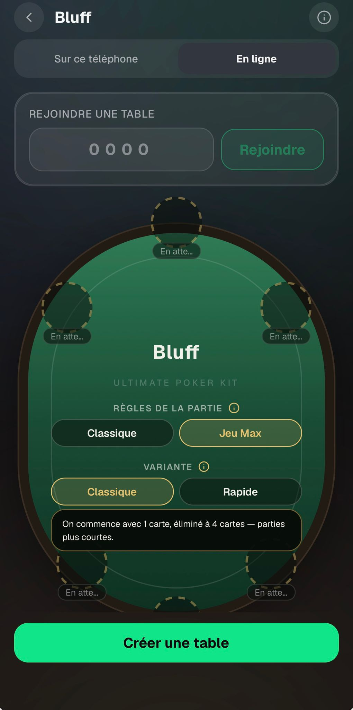
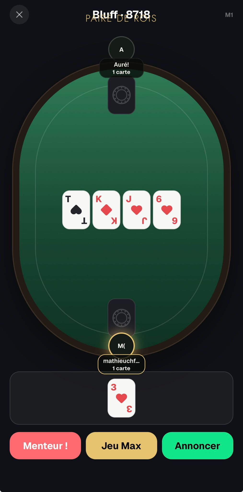

# Bluff — Feedback Mathieu (30 août 2026)

Source : WhatsApp, messages du 30/08 19:41 → 20:00.

> « Franchement très fun le bluff »

---

## 1. La description de variante est toujours celle de « Rapide » — bug bloquant

> « Le message de règle du bluff entre classique et rapide est pas bon »

Sur la capture, « Classique » est sélectionné et le texte affiché est « On commence avec 1 carte,
éliminé à 4 cartes — parties plus courtes », c'est-à-dire la description de **Rapide**.

`app/games/bluff/index.tsx:85` câble `info: t('setup.variantQuickHint')` en dur, quelle que soit la
variante — et il n'existe aucune clé standard. OFC le fait correctement juste à côté
(`app/games/ofc/index.tsx:73` alterne `variantClassicHint` / `variantPineappleHint`).

**Décision** : ajouter `setup.variantStandardHint` en fr/en (« On commence avec 2 cartes, éliminé à 5
cartes. ») et rendre `info` conditionnel sur `variant`.

## 2. Un Jeu Max réussi à 1 carte termine la partie — bug bloquant

> « Alors il vient de se passer quelque chose d'insane au bluff : On a joué en rapide, et j'ai gagné
> un jeu max dès la première main, je me suis retrouvé à 0 carte et du coup le jeu c'est arrêté et m'a
> déclaré gagnant alors que je dois continuer à jouer mais avec 0 carte »

`src/lib/bluff/engine.ts` cas `nextRound`, lignes 411-421 : se défausser de sa dernière carte gagne la
partie sur le champ (avec le flag `jeuMaxWinsGame` posé au reveal, `:393`). En variante **rapide**
`startCards` vaut 1, donc un Jeu Max réussi à la première main finit la partie.

**⚠️ Il se contredit.** « À 0 carte tu gagnes » est la règle qu'il a lui-même donnée, et elle est
écrite noir sur blanc dans le hint du setup qu'il a validé (`bluff.json` `setup.jeuMaxHint` : « …si la
dernière annonce est vraiment le jeu maximum possible, tu te débarrasses d'une carte — **à 0 carte tu
gagnes**. Sinon tu en prends une. »).

**Décision : on suit son nouveau message.** 0 carte ne gagne plus, on continue à jouer à 0 carte, et
la partie ne se termine que par élimination (`alive.length === 1`, `:446-458`).

- retirer le retour `gameOver` de `:411-421` et le flag `jeuMaxWinsGame` ;
- retirer le message `game.jeuMaxWin` des deux locales et corriger `setup.jeuMaxHint` ;
- un joueur à 0 carte reste dans la rotation : il ne contribue rien à `resolutionPool` (déjà géré), et
  s'il perd le tour il repasse à 1 carte (`:444`, déjà correct) ;
- tests : un Jeu Max réussi à 1 carte ne termine plus la partie, un joueur à 0 carte reste jouable.

**Question à lui poser** : à 0 carte, peut-il encore annoncer et crier menteur ? On part du principe
que oui.

**Effet de bord bienvenu** : ça dissout un problème qu'il n'a pas signalé — une victoire par Jeu Max
n'était *déclarée* qu'après un clic sur « Manche suivante », qui en ligne n'appartient qu'à l'host,
donc un invité gagnant attendait l'host pour voir son écran de victoire.

## 3. Les annonces collent au titre de la partie

> « Les annonces devraient être au dessus du board pas en haut ? (Problème d'affiche entre le titre de
> la partie et les annonces) »
>
> « Juste à mon avis agrandi la table, et met les annonces au milieu de la table ça sera bcp mieux »

Sur la capture, « PAIRE DE ROIS » chevauche « Bluff · 8718 ».

La caption est rendue **au-dessus** du feutre dans `styles.tableArea` (`app/games/bluff/play.tsx:270`,
`online.tsx:374`), et passe donc sous le titre du `GamePlayHeader`. En fin de manche c'est
`resultBanners` qui prend ce même emplacement — jusqu'à 5-6 lignes.

**Décision** : les déplacer **dans** le feutre, au-dessus de la rangée de cartes. Le pattern existe
déjà chez le replayer (`SHOWDOWN` + pastille de pot au centre de `SeatedTable`). Dans `play.tsx`
**et** `online.tsx`.

## 4. « Agrandis la table » — contre-intuitif : elle est déjà trop grande

`BluffTable` a une hauteur **fixe** (`PLAY_TABLE.height` + `marginVertical: 52` ≈ 580pt de boîte) que
le `flex: 1` de `styles.tableArea` ne peut pas comprimer. Header 48 + caption/bannières + 580 +
`handZone` 88 + footer 76 + safe areas dépassent l'écran : le feutre débarde et les pods du haut et du
bas sont **coupés** — ce qui se lit comme « petit ».

**Décision** : faire §3 d'abord (la ligne d'annonce libère 22 à 130pt), puis rendre la hauteur de
`BluffTable` **mesurée** sur la place réellement restante, comme `setupTableSize(availableH)` le fait
déjà côté setup, au lieu d'une constante.

**Ne pas toucher `PLAY_TABLE`** : il est partagé avec flip et le replayer, et `seatLayout.test.ts`
verrouille son plancher de 420pt.

## 5. « M( » au-dessus du pseudo, et le wordmark manquant

> « Au dessus de mon pseudo il ya marqué M( c'est normal ? »
>
> « Ajouter Ultimate Poker Kit en dessous du board »

Non, ce n'est pas normal. `initials()` (`src/lib/format.ts:73`) découpe sur les espaces et prend la
1re lettre des 2 premiers mots ; on lui passe le nom **décoré** « mathieuchfd (toi) », d'où `M` + `(`.

**Décision** : supprimer le suffixe « (toi) » sur le siège du bluff et ne passer que le pseudo brut —
ton siège est de toute façon toujours en bas (`rotateToViewer`), le suffixe est redondant. La bande de
sièges OFC garde le sien, elle n'a pas d'avatar à initiales.

Pour le wordmark : `TableWordmark` sert déjà au replayer, à flip, au lobby et aux options de setup — il
manque juste aux deux écrans de jeu du bluff. Une ligne dans chacun, sous la rangée de cartes. À poser
aussi sur le nouveau feutre OFC.
