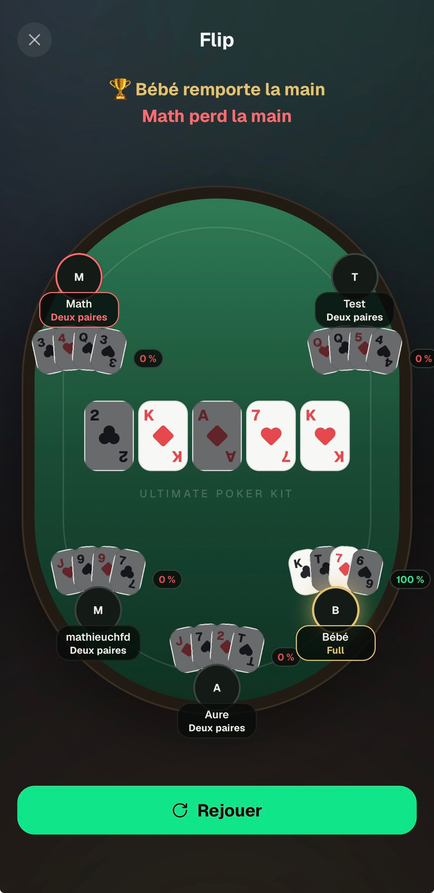

# Flip — Feedback Mathieu (30 août 2026)

Source : WhatsApp, message du 30/08 18:40.

---

## 1. « X perd la main » ne marche pas à plus de 2 joueurs

> « Petit problème du message : Math a perdu la main, on a tous perdu la main sauf le gagnant, le
> message ne marche pas quand il y a plus de 2 joueurs, mettre juste le gagnant »

Sur la capture, à 5 joueurs : « 🏆 Bébé remporte la main » puis « Math perd la main » — et les trois
autres n'apparaissent nulle part.

Nuance importante : `loserIds` **n'est pas** le complément du gagnant. C'est l'ensemble des ex æquo de
la **pire** main, c'est-à-dire *qui paie* — ce qui est le point du jeu (`flip.subtitle` dit « la main
la plus faible paie »). Le problème est donc le **mot** : « perd la main » se lit comme le complément
du gagnant. Et à partir de 3 joueurs `groupMessage` fait s'effondrer le sujet en « N joueurs »
(`app/games/flip/play.tsx:189-197`), ce qui aggrave la confusion quand plusieurs sont ex æquo au pire.

**Décision : une seule bannière, le gagnant** — c'est ce qu'il demande. L'anneau rouge sur le siège de
la plus faible main reste et dit déjà qui paie. Les clés `flip.losesHand_one` / `_other` deviennent
mortes et sortent des deux locales ; vérifier que `flip.playersCount_*` et `flip.twoNames` servent
encore côté gagnants avant de les toucher.
