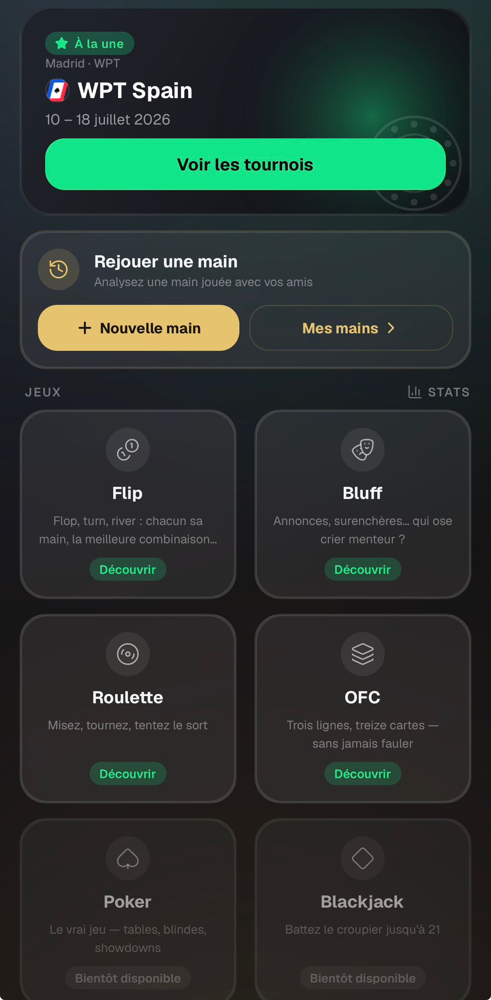

# Accueil — Feedback Mathieu (30 août 2026)

Source : WhatsApp, message du 30/08 18:48.

---

## 1. « fauler » n'existe pas

> « La description d'OFC : Fauter au lieu de Fauler non ? Ça existe pas fauler »

Il a raison. `src/i18n/fr/degen.json:6` — seule occurrence du mot dans tout le repo. L'anglais dit
« don't foul », donc le français était un calque du terme de poker *to foul*.

**Décision** : « Trois lignes, treize cartes — sans jamais fauter ». L'anglais ne bouge pas, et la
parité i18n reste verte (pas de `{{placeholder}}`, pas de suffixe de pluriel).

## 2. Roulette → « Tirage » / « Draw »

> « Et j'me demandais si ça serait pas mieux de mettre Tirage (Draw) en anglais à la place de roulette
> vu que c'est plus du tout une roulette, et que avec blackjack Poker etc, avoir le nom roulette fait
> vraiment casino quoi »

Argument juste : le jeu a été refait en tirage de cartes sur table (batch du 27/08), il n'y a plus de
roue.

**Décision : rename de libellé seulement.** Les identifiants internes — `GameKey: 'roulette'`
(`src/lib/gameStats.ts:7`), `rouletteLastPlayers` (persisté dans le `partialize` de `useAppStore`),
`PseudoStats.roulette` (clé de stockage par pseudo) — sont des **clés de stockage persistées** : les
renommer demanderait une migration, et perdrait silencieusement les rosters et les stats sauvegardés
si on l'oubliait. Pour un changement de nom d'affichage, ça ne vaut pas le risque.

Ce qui change :

- les trois littéraux → `t()` : `app/index.tsx:147` (`name="Roulette"`),
  `app/games/roulette/index.tsx:30` (`title="Roulette"`), `app/games/roulette/play.tsx:20`
  (`GAME_NAME`, dont le commentaire « proper noun — do-not-translate glossary » tombe). Il n'existe
  aucune clé de **nom** de jeu, seulement des descriptions : il faut en créer une.
- `src/i18n/{fr,en}/stats.json:9` → « Tirage » / « Draw ».
- reformuler `games:roulette.start` et `.spinWheel` (« Lancer la roulette ») et `stats:roulette.spins_*`
  (« N spins »). `spinning` dit déjà « Tirage… » / « Drawing… », `spinAgain` déjà « Draw again ».
- les deux fiches de store (`docs/store/app-store-listing.md:42,92`,
  `docs/store/play-store-listing.md:49,84`).

Le dossier de route `games/roulette`, `useRouletteDraft` et `RouletteCardTable` restent.

## 3. Trouvé en explorant — copie périmée après la suppression des onglets

`src/i18n/{fr,en}/stats.json` `empty.subtitle` invite encore à passer par « l'onglet Jeux » /
« the Games tab », supprimé par `3d38e64`. À reformuler dans les deux locales.

## Clos — la barre d'onglets

Son point du 18:50 (« est-ce que tu es sûr que c'est une bonne idée d'avoir retiré le menu en bas ? »)
a été discuté sur place et il a concédé : « Ok pas de soucis, j'avais sûrement juste pris l'habitude »,
« comme tu le sens ». La position de Rémy tient — profil et stats ne justifiaient pas un onglet, et
l'accueil ouvre direct sur les jeux avec « Nouvelle main » à portée. **Rien à faire.**
