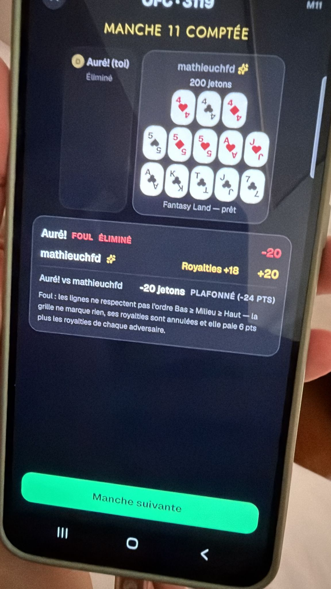
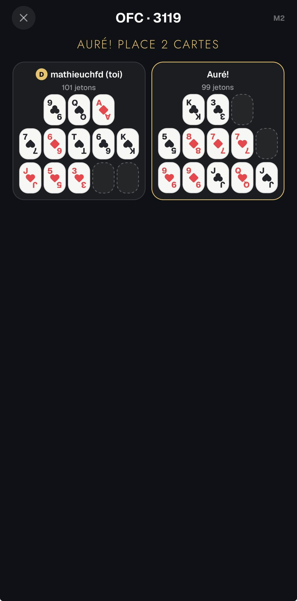
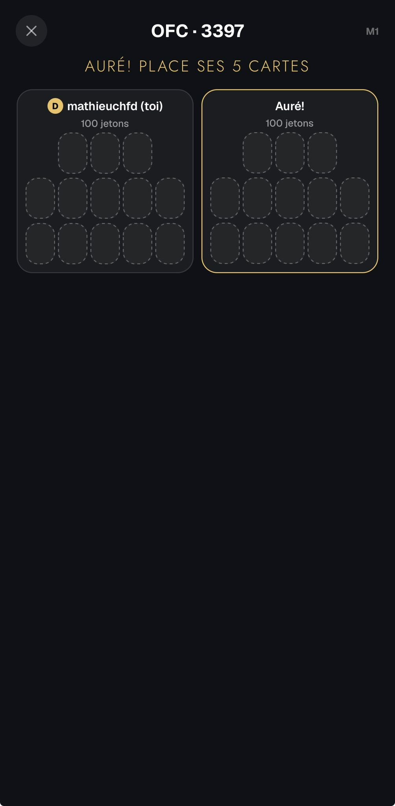
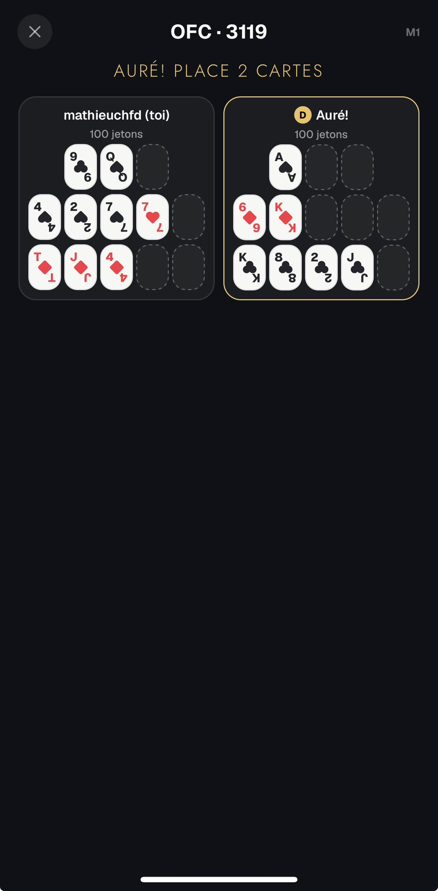
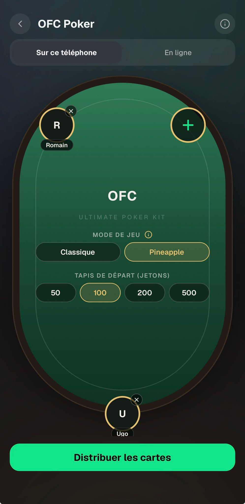
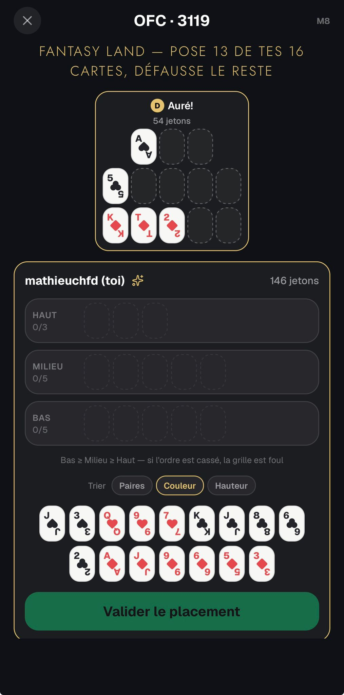
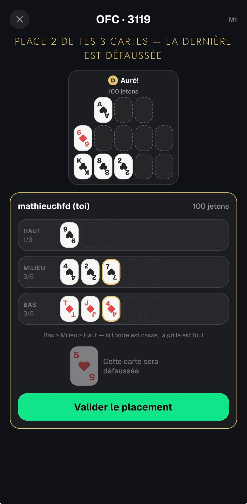

# OFC — Feedback Mathieu (30 août 2026)

Source : WhatsApp, messages du 30/08 18:38 → 19:40. Première partie en ligne à deux, sur Android.

---

## 1. Un host éliminé gèle la table pour toujours — bug bloquant

> « Quand la partie est terminée — Le jeu est bloqué sur manche suivante (sans pouvoir cliquer sur le
> bouton) et sans pouvoir relancer une autre partie »

`validateAction` (`src/lib/ofc/engine.ts:258-261`) refuse **toute** action d'un joueur éliminé avant
même de regarder le type d'action — donc `nextHand` et `deal` aussi. Or seul l'host les émet, avec
`playerId: myId` (`app/games/ofc/online.tsx:276`). Dès que l'host se fait sortir, « Manche suivante »
ne produit qu'un toast rouge et les invités restent sur « L'hôte lance la manche suivante… » pour
toujours. En heads-up (2 des 3 joueurs max) c'est une partie sur deux.

L'écran de la capture est justement celui de l'host éliminé : « Auré! (toi) — Éliminé », et
mathieuchfd est en Fantasy Land, donc seul survivant.

**Décision** :
- sortir le garde `player.eliminated` du préambule et le poser dans les seuls cas d'**action de
  joueur** (`placeInitial`, `placeDraw`, `placeFantasy`) — `deal` et `nextHand` sont des actions de
  **table** ;
- même correction au bluff, qui a le garde identique (`src/lib/bluff/engine.ts:213`) ;
- ne plus proposer « Manche suivante » quand il ne reste qu'un vivant : afficher directement
  `GameOverActions` ;
- tests : un host éliminé peut toujours `nextHand` et `deal`.

## 2. Écran noir pendant l'attente

> « Niveau design faudrait faire un truc aussi » / « Peut être mettre une table pour le moment
> d'attente plutôt que cet écran noir » / « Dans le style de l'OFC en local »

Hors de son tour et hors scoring, `app/games/ofc/online.tsx` ne rend que la caption et
`OfcSeatsStrip` : tout le bas de l'écran est vide sur `SCREEN_BG`. Les panneaux d'action
(`OfcActorPanel` + `PlacementBoard` / `DrawPlacement`) sont conditionnés au rôle.

À noter : « dans le style de l'OFC en local » ne peut pas être pris au mot — **l'écran local n'a pas
de table non plus**, il a exactement la même structure. Ce qui le sauve, c'est que le panneau
d'action du joueur qui agit remplit l'écran, donc on ne voit jamais le vide.

**Décision** : donner un vrai feutre aux **deux** écrans de jeu OFC (local et en ligne), avec les
grilles posées dessus, en réutilisant `PokerTable`, la surface de `gameSurface.ts` et
`TableWordmark`. C'est le chantier que le batch du 29/08 avait déjà relevé (« l'écran de jeu OFC n'a
pas de table du tout »). À faire **après** le correctif d'ordre de dessin Android, qui touche
justement le feutre.

## 3. La table du menu est trop grande, le pseudo du bas disparaît

> « Menu OFC, table un peu trop grande, le pseudo en bas disparaît un peu »

Cause exacte : `src/components/games/SeatTableBoard.tsx:80-94`. `overhang()` ne réserve que la
**moitié du cercle du siège** (`SEAT_D / 2` = 29pt) et rien pour la plaque de nom qui pend dessous
(~13pt de débord, après le `marginTop: -6` de `styles.seatWrap`). En mode `fill`, le feutre mange
toute la hauteur restante, donc `boardH` colle pile à la hauteur offerte : zéro marge, et la plaque
passe sous la CTA collante. Régression de `52ceb17` (« the setup board only reserves room where a
seat actually sits »), qui a supprimé le `padY = SEAT_D/2` inconditionnel.

Le siège à 90° existe pour OFC (`[90, 225, 315]`) **et** pour le bluff à 6 joueurs — les deux
clippent.

**Décision** : ajouter la hauteur de la plaque à `padBottom` quand un siège est à 90°.

**Bonus trouvé au passage** : la branche « En ligne » d'OFC (`app/games/ofc/index.tsx:151-161`) et du
bluff (`app/games/bluff/index.tsx:153-163`) ne passe **pas** `fill` à `SeatTableBoard` alors que le
`SetupBlock` le réclame — le feutre en ligne est dimensionné par fraction d'écran pendant que le bloc
réclame le reste.

## 4. L'host ne devrait pas avoir à valider la manche suivante

> « C'est toujours l'host qui relance la manche suivante, pas sûr qu'il ai besoin de valider pour
> passer à la manche suivante »

Aucun timer n'avance de manche nulle part : l'host clique, les autres lisent « L'hôte lance la
manche suivante… ». Même retour de sa part côté bluff (19:51).

**Décision** : enchaînement **automatique, sans bouton**, dans les deux jeux. La phase `scoring` /
`roundEnd` avance d'elle-même côté host, en laissant la feuille de score affichée assez longtemps
pour être lue. `online.waitingNextHand` / `waitingNextRound` deviennent inutiles. Le cas « dernière
manche » va en `gameOver` et affiche `GameOverActions` (voir §1).

## 5. On ne devrait pas voir le jeu adverse pendant la fantaisie

> « Pas censé pouvoir voir le jeu adverse pendant la fantaisie »

Le sens « les autres ne voient pas la grille du joueur en fantaisie » est **correct et testé**
(`src/lib/ofc/__tests__/protocol.test.ts:100`, `view.test.ts:68`) — pas de fuite de ce côté. Mais le
secret est à sens unique : `gridVisibleTo` (`src/lib/ofc/protocol.ts:54-60`) ne cache que la grille du
joueur *en* fantaisie, donc **lui** voit les placements adverses se construire — et il pose ses 13
cartes après, avec toute l'information. Sur la capture, mathieuchfd est en Fantasy Land avec ses 16
cartes en main et la grille d'Auré! est visible en train d'être remplie.

**Décision** : secret **symétrique**. Tant qu'un viewer est `inFantasyLand && !fantasyPlaced`, il ne
voit pas les grilles des autres ; tout se révèle en `scoring`. Un seul point de passage à modifier —
`gridVisibleTo`, dont la signature a besoin de l'état du viewer — plus ses deux appelants
(`redactFor` et l'écran Pass & Play). Tests des deux sens.

## Clos — pas un bug

Les placements qui « restaient bloqués » (19:01, 19:05) étaient son wifi, il l'a établi lui-même :
« même si elle valide son jeu quand je suis sur WhatsApp ça marche quand je reviens », « on a juste un
wifi de merde ». L'état d'envoi sur les actions ([online/](../online/FEEDBACK.md#6)) réduit la
frustration sans qu'il y ait de bug à corriger.

