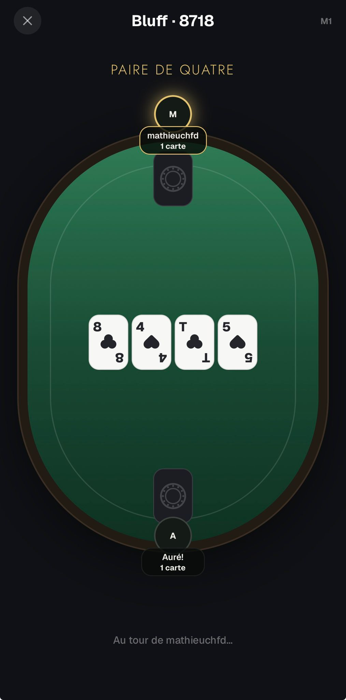

# Online — Feedback Mathieu (30 août 2026)

Source : WhatsApp, messages du 30/08 18:58 → 21:02. Première partie en ligne à deux, sur Android.

> « L'app fonctionne bien sûr android par contre pas de bug pour le moment »

---

## 1. La ❌ ferme la room sans confirmation — bug bloquant

> « Quand tu cliques sur la croix ❌ en haut à gauche pendant une partie en ligne, ça termine la partie
> et clôture le serveur même si tu as pas appuyé sur confirmer ou annuler »

Le garde n'est armé que **pendant la main** : `useConfirmQuitGame(status === 'playing' && view?.phase
!== 'gameOver')` (`app/games/ofc/online.tsx:90`, `bluff/online.tsx:103`). Partout ailleurs le ❌ démonte
l'écran sans rien demander, et le cleanup du `useEffect` socket (`src/hooks/useBluffOnline.ts:158-167`)
enchaîne `game:broadcast{gameEnded}` + `room:leave` + `socket.disconnect()` → côté serveur
`apps/api/src/index.ts:178-186` fait `closeRoom(room, 'host_left')`.

**Dans le lobby, la ❌ tue donc la room instantanément, sans confirmation** — le cas le plus probable de
ce qu'il décrit. Idem en `connecting` (le bouton Annuler). À `gameOver` c'est voulu.

Le `socket.disconnect()` collé aux deux `emit` est en plus un risque de flush non terminé.

**Décision** :
1. armer la confirmation dès qu'une room existe côté host, **lobby compris** ;
2. la ❌ appelle un `confirmQuit()` explicite — une `Promise<boolean>` autour de `Alert.alert` — et ne
   navigue qu'après un « oui ». `usePreventRemove` reste le filet pour le back Android et le
   edge-swipe iOS ;
3. attendre l'ack de `room:leave` avant `socket.disconnect()`.

## 2. Pas de reconnexion

> « Premier test en multi, je suis rentré dans l'app, je suis ressorti pour te parler, et ça reste
> figer »
>
> « Comme t'as dis ya pas de reconnexion, j'suis revenu sur le code de la partie et je pouvais plus
> jouer même si je me voyais bien dans la partie »

Sur la capture il est bien dans la partie, c'est même son tour (« Au tour de mathieuchfd… ») — mais il
n'a aucun bouton d'action.

**Ce n'est pas un problème de rejeu d'événements.** Le protocole est host-autoritaire et diffuse
l'**état complet redacté** par joueur à chaque changement (`useOfcOnline.ts:63-75`), avec un `version`
monotone et un garde anti-état-périmé. Un client qui revient a juste besoin d'un état frais, et
`room:rejoin` → `broadcast()` / `requestState` le livre déjà. Le serveur a aussi ce qu'il faut : token
de session, `HOST_GRACE_MS` 60s, siège conservé avec `socketId = null` sur une déconnexion inattendue.

Ce qui manque est **entièrement côté client** :

1. **session persistée** — `sessionRef` est un `useRef`, donc perdu au démontage de l'écran. La sortir
   vers MMKV, pour les deux rôles ;
2. **`room:leave` seulement sur un quit volontaire** — aujourd'hui le cleanup l'émet sur n'importe quel
   démontage, donc revenir est impossible par construction. Se branche sur §1 ;
3. **rejouer `room:rejoin` au remontage** ;
4. **état de jeu de l'host persisté aussi** — `gameRef` est un `useRef` : si l'host quitte l'écran ou
   que l'app est tuée, l'état disparaît et aucun rejoin ne peut le récupérer, la room est morte pour
   tout le monde. C'est exactement le premier scénario qu'il a testé ;
5. **visibilité réseau** (voir §5) ;
6. vérifier la durée de vie de la room côté `apps/api` après déconnexion du dernier socket.

## 3. Partager le code

> « Option pour envoyer le code avec un lien de la partie via WhatsApp, messages ou autre »

`LobbyFelt` (`src/components/games/LobbyFelt.tsx:23-31`) affiche le code avec la légende « Partage ce
code avec les autres joueurs » — sans aucune action. Il n'y a ni `Share`, ni `Clipboard`, ni deep link
dans le repo (le seul `expo-sharing` sert à la vidéo du replayer).

**Décision** : un bouton « Inviter » sous le code → `Share.share()` de **react-native** (pas
`expo-sharing`, qui ne partage que des fichiers) avec le code en texte. **Pas de lien profond dans ce
run** : ça couvre déjà l'essentiel du besoin — envoyer le code sur WhatsApp sans le recopier. La page
`/join/:code` sur `apps/api` (qui héberge déjà privacy, support et account-deletion) plus le handler de
deep link restent pour plus tard.

## 4. Notification push quand c'est ton tour — hors périmètre

> « Notif push quand c'est à toi de jouer »

Rien de posé aujourd'hui : ni `expo-notifications`, ni enregistrement de token, ni envoi côté API.

**Décision : hors périmètre pour ce run.** Ça dépend entièrement de la reconnexion (§2) — une notif qui
ramène sur une partie injouable est pire que rien. À reprendre une fois §2 en place et testée à deux
appareils.

## 5. Trouvé en explorant — aucune visibilité réseau

Il n'y a aucun listener `disconnect` / `connect_error` côté client : hors ligne, l'écran continue
d'afficher une partie vivante, et les pairs ne l'apprennent que par le `connected: false` du prochain
`room:members` (rendu dans le lobby et dans `OfcSeatsStrip` — `BluffTable` l'ignore complètement).

Et le `room:rejoin` de l'host n'a pas de branche d'erreur (`useOfcOnline.ts:113-117` : `if (res.ok)`
sans `else`), donc un host dont la room a expiré cale en silence, là où les invités reçoivent
correctement `status: 'error'`.

**Décision** : un bandeau « reconnexion… » et une vraie branche d'erreur sur le rejoin. Va avec §2.

## 6. L'attente muette fait croire à un blocage

> « dès la deuxième donne, j'ai validé le placement de mes cartes, ma pote voit bien, mais moi ça reste
> bloqué avec le bouton valider le placement qui ne s'enlève pas »
>
> puis : « En faite ça charge juste longtemps des fois, on arrive à jouer mais c'est pas fluide » et
> « On a juste un wifi de merde »

Il a lui-même conclu que rien n'était perdu et que c'était son réseau — **ce n'est pas un bug**. Mais
un état d'attente muet lui a fait croire deux fois à un blocage, et Rémy a proposé d'y répondre : « je
peux améliorer l'ux pour que ce soit moins frustrant avec des loaders par exemple ».

**Décision** : après l'envoi d'une action, désactiver le bouton et afficher un indicateur tant que la
version d'état n'a pas bougé. Empêche aussi le double-clic.

## 7. Trouvé en explorant — un retardataire tombe sur un écran noir

Un joueur qui rejoint **après** le lancement n'est pas dans `view.players` (`startGame` photographie
`membersRef`, `useOfcOnline.ts:169`), donc `me` est `undefined` et l'écran fait `return null`
(`ofc/online.tsx:256`, `bluff/online.tsx:267`) : **écran noir total, sans explication**. La room accepte
pourtant jusqu'à 6 membres.

**Décision** : `apps/api` refuse un `room:join` sur une room dont la partie est lancée, **sauf** si le
`playerId` correspond à un siège existant — donc un rejoin légitime, à coordonner avec §2. L'écran de
saisie du code affiche alors une vraie erreur, via le mécanisme `JOIN_ERROR_KEYS` déjà en place.

## 8. Trouvé en explorant — un invité en fin de partie ne sait pas qu'on peut relancer

`GameOverActions` omet `onReplay` pour un invité (`src/components/games/GameOverActions.tsx:30`,
« Omitted for a guest — only the host may restart an online table »). L'invité ne voit donc qu'un bouton
« Quitter », et rien ne lui dit que l'host peut lancer une revanche — il risque de partir juste avant.

**Décision** : un `waitingLabel` optionnel sur `GameOverActions` (« l'hôte peut relancer une partie… »),
câblé dans les deux écrans en ligne.
