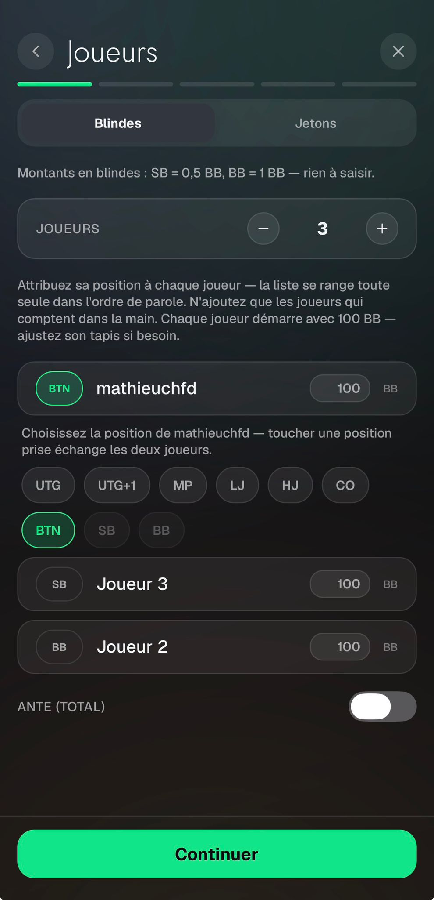
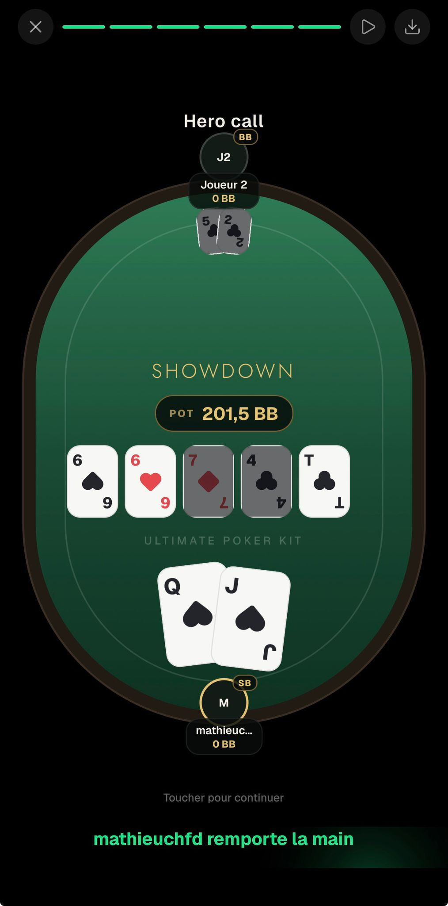

# Replayer — Feedback Mathieu (30 août 2026)

Source : WhatsApp, messages du 30/08 18:19, 18:22, 18:36 et 20:19.

---

## 1. Le heads-up est déduit au lieu d'être demandé

> « quand je mets que 2 joueurs, BTN vs BB, ça met que BTN est BTN/SB, c'est vrai dans le cas où il ne
> reste plus que 2 joueurs dans le tournoi ou 2 joueurs à une table de cashgame, mais c'est pas vrai
> pour la plupart des scénarios où j'ai juste envie de raconter une main où je suis au BU contre la BB,
> faudrait trouver un moyen quand y'a que 2 joueurs dans le coups de demander si il y a que 2 joueurs
> restants à table (Heads-up abréviation HU) ou si c'est juste un coup normal »

`computeBlindPosting` (`src/lib/handPositions.ts:41-53`) **déduit** le heads-up de « exactement 2
joueurs + BTN + BB », avec le commentaire qui l'assume comme une convention. Rien ne permet de dire
« non, c'était une table pleine, je n'ai entré que les 2 joueurs du coup ».

**Décision** : rendre le heads-up **explicite**. Un switch « Heads-up (2 joueurs à table) » en étape 0,
visible seulement à 2 joueurs, **off par défaut** — son cas courant est BU vs BB sur table pleine, où
la SB devient de la dead money. Stocké dans `HandHistory` (`src/types/hand.ts`) et passé en
**paramètre** à `computeBlindPosting` au lieu d'être inféré.

**Divergence trouvée au passage** : `app/hand-replayer/play.tsx:293-294` **redéfinit** la règle sans le
contrôle `has('BB')` que fait `computeBlindPosting`. Un roster BTN+CO affiche donc `BTN/SB` sur le
feutre alors que le moteur poste la SB en dead money. À faire appeler la fonction partagée.

## 2. Les positions prises ont l'air désactivées

> « Les positions SB et BB sont grisés alors qu'on peut cliquer dessus, c'est bien qu'elles soient pas
> grisés, le fait que quand tu cliques dessus ça change la position de l'autre joueur qui était déjà en
> BB, c'est très bien comme fonctionnement, juste du coup faut pas que SB et Bb soient grisées »

`app/hand-replayer/index.tsx:867-874` : `takenByOther` met `opacity: 0.45` sur une position déjà
occupée par un autre joueur. Elle reste parfaitement cliquable — et la toucher **échange** les deux
joueurs, ce qu'il trouve « très bien comme fonctionnement ». Il n'y a aucun `disabled` dans ce picker.

**Décision** : retirer l'opacité et marquer les positions prises par une **bordure discrète à pleine
opacité** — elles ne lisent plus comme désactivées mais restent distinguables des libres. Le hint
`positionPickerHint` explique déjà l'échange.

## 3. Le nombre de joueurs par défaut

> « Le nombre de joueurs initiales du replayer devrait être à 2, c'est ce qu'on utilise le plus souvent,
> raconter la HH contre un seul joueur »

`makePlayers(3, …)` → `makePlayers(2, …)` à `index.tsx:83` et sur le chemin de reset `:390`.

## 4. Le libellé de l'ante dit « par joueur » alors que c'est un total

> « Phrase de Ante : Ante de 1BB par joueur, c'est Ante 1 BB total, pas total par joueur »

Le **calcul** est déjà un total : `anteLabel` dit « Ante (total) », `anteHint` dit « total des antes
posées par tous les joueurs, ajouté au pot comme argent mort », et le montant est injecté tel quel dans
`computePots` comme dead money. Seule la chaîne `anteEqualsBb` est fausse
(`src/i18n/{fr,en}/replayer.json:122`).

**Décision** : fr → « Ante de {{amount}} au total — toucher pour un autre montant. », en →
« {{amount}} ante in total — tap to set another amount. »

## 5. Cartes adverses trop petites au reveal

> « Cartes du joueur adverses trop petite lors du reveal c'est dommage, tu peux pas les mettre de la
> même taille que les autres ? (Problème quand il y a bcp de joueurs ?) peut être focus sur un beau
> reveal avec grosses cartes 2/3 joueurs (95% des scénarios) et petites cartes quand il y a plus de
> joueurs? »

`app/hand-replayer/play.tsx:322-332` code `size: 'sm'` (30×42) **en dur** pour les fans adverses,
pendant que le héros passe en `lg` (64×90) au showdown.

Le helper qu'il décrit **existe déjà** : `fanSizeFor(count, seatCount)`
(`src/components/table/fanGeometry.ts:14`) rend `md` (46×64) à moins de 4 cartes et moins de 5 sièges,
`sm` sinon — soit exactement « grosses cartes à 2/3 joueurs, petites au-delà », Omaha compris.

**Décision** : `fanSizeFor(p.cards.length, hand.players.length)`. Une ligne, zéro nouvelle constante.

## 6. Le titre : police, taille, espacement

> « Titre de la vidéo : Police d'écriture (remettre l'autre police ?) + Empacement (un peu trop proche
> de J2 + Taille police ? »

`styles.caption` (`play.tsx:654-661`) : `fontSize.md` (16) en `Geist_600SemiBold`, collé au-dessus de la
table. Tout le reste du feutre parle en `fontFamily.display` (`Jost_300Light`, majuscules espacées —
cf. `styles.streetLabel` juste en dessous).

À noter : l'historique git ne montre **aucun** changement de cette police depuis le commit d'origine —
il n'y a donc pas d'« autre police » à restaurer, c'est une préférence.

**Décision** : passer à `fontFamily.display`, monter à `fontSize.xl`, ajouter du `marginBottom` pour
dégager le pod du siège haut. Capture sur simulateur avant de figer.

## 7. Supprimer l'animation badbeat

> « Et surtout, supprimer l'animation que tu as mise : Badbeat il n'avait que 13% etc toute ces
> animations là c'est pour le jeu flip, pas pour le replayer »

Le bad beat est en réalité **propre au replayer** : `detectBadBeat` + `BAD_BEAT_EQUITY_PCT = 30`
(`src/lib/handShowdown.ts:107-139`), une seconde simulation d'équité sur le board du turn, rendue en
`play.tsx:524-531`. Flip n'en a pas. Ce qui est partagé avec flip, c'est le composant
`WinCelebration` et le calcul d'équité (`estimateEquity`), pas le bad beat.

**Décision** : retirer l'overlay badbeat et l'appel à `detectBadBeat`, nettoyer les clés
`badBeatOverlay.*`. **On garde** la `WinCelebration` du gagnant, qu'il n'a pas demandé de supprimer
(corrigée par §8).

**⚠️ à savoir** : les deux overlays étaient **déjà** absents du MP4 exporté — ils sont court-circuités
pendant `exportState === 'exporting'` (`play.tsx:190`, `:204`). Son retour portait donc sur la lecture
à l'écran, pas sur la vidéo. Le correctif vaut pour les deux de toute façon.

## 8. Un pot partagé est annoncé comme une victoire — bug bloquant

> « Quand les 2 joueurs split : c'est à dire par exemple il y a 5❤️ sur le board et personne n'a de cœur
> dans sa main, ou il y a 23456 et personne n'a de 7, il y a une animation qui s'affiche Mathieu
> remporte la main alors que c'est pas vrai c'est un split. En bas il y a bien marqué qu'on se partage
> le pot par contre »

Diagnostic exact. Deux chemins indépendants :

- la bannière du bas (`play.tsx:559-574`) gère bien le split — `splitWins` quand
  `winners.length > 1` ;
- l'overlay animé (`play.tsx:533-540`) est armé par `heroWins` (le héros est *dans* `winnerIds`) et
  affiche `t('winsHand', { name: hero.name })` sans se soucier du nombre de gagnants.

**Décision** : n'armer l'overlay que si `winners.length === 1`. Un chop ne déclenche plus rien — seule
la bannière du bas, déjà correcte, l'annonce.
