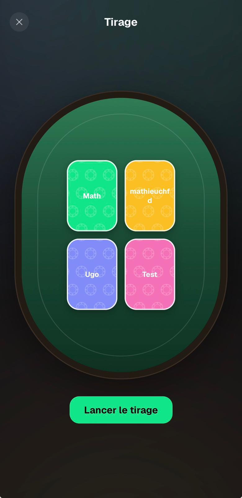

# Navigation — Feedback Mathieu (31 août 2026)

Source : WhatsApp, message du 31/08 21:03.

> « Quand je suis à la fin d'une main que je viens de créer ou sur une main déjà créé, il faut 2
> cliques pour revenir au menu principal.
>
> Pour les jeux, la croix amène direct au menu principal. Possibilité de mettre un bouton HOME en
> haut à droite ?
>
> Pour les Mains, tu cliques sur la croix, ça te met sur le menu des mains, tu cliques sur Home, ça
> te ramène à l'accueil.
>
> Pour les jeux, tu cliques sur la croix, ça te ramène au menu du jeu, tu cliques sur HOME ça te
> ramène à l'accueil »

---

## 1. ❌ remonte d'un cran, HOME rentre à l'accueil

État actuel : **les six `onClose` d'écran de jeu font `router.dismissTo('/')`** — aucun ne remonte
d'un cran. Côté replayer, ❌ fait déjà `router.back()`, donc il remonte bien, mais il n'y a pas de
raccourci vers l'accueil : d'où ses deux clics.

La pile est un `Stack` plat (`app/_layout.tsx`) et le seul chemin d'entrée dans un jeu est
`/ → /games/x → /games/x/play`. Donc `router.back()` depuis un écran de jeu tombe **exactement** sur
le menu du jeu : la sémantique qu'il demande ne coûte rien côté routeur.

**Bénéfice au-delà de sa demande** : après une partie, ❌ ramène au menu du jeu avec les joueurs déjà
sélectionnés, au lieu d'obliger à tout refaire depuis l'accueil.

**Décision : les deux, jeux et replayer.**

Trois pièges relevés à l'exploration :

1. `GamePlayHeader` centre son titre grâce à un `minWidth: 32` sur le slot droit — ajouter un second
   bouton à gauche décale le titre si on ne compense pas.
2. `usePreventRemove` intercepte **aussi** le `back()`. Les deux chemins doivent continuer à passer
   par `confirmQuit()`, sinon la confirmation est posée deux fois.
3. `GameOverActions.onFinish` partage aujourd'hui le même handler que le ❌. Après le changement,
   « Terminer » sur une partie finie remonterait au menu du jeu — il lui faut son propre handler vers
   l'accueil, parce que terminé veut dire terminé.

Au passage, le littéral `dismissTo('/')` est recopié dans six fichiers : il devient un helper partagé.
