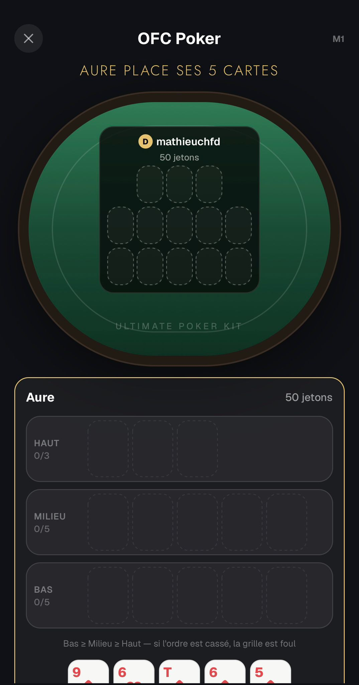

# OFC — Feedback Mathieu (31 août 2026)

Source : WhatsApp, message du 31/08 20:46.

> « Il est plus difficile de voir toutes les informations à l'OFC maintenant qu'il y a la jolie table
> design.
> Table plus petite ?
> Revenir au truc initial ?
> Laisser comme ça ? »

---

## 1. Le feutre mange l'écran — régression de la veille

Il a raison, et c'est une régression introduite la veille en réponse à son propre retour du 30/08
(« mettre une table pour le moment d'attente plutôt que cet écran noir »).

Sur la capture : le feutre occupe environ 40 % de la hauteur pour afficher **une seule grille `sm`
vide**, et le panneau d'action — les trois rangées, la main, le bouton de validation — est repoussé
si bas qu'il sort du cadre. L'écran de jeu est devenu joli et moins jouable.

Cause dans `src/components/ofc/OfcTableFelt.tsx` :

- `FLOOR_RATIO = 0.85` impose un plancher d'environ 300pt « pour qu'un ovale lise comme une table »,
  alors que le contenu réel à deux joueurs (une grille, un nom, un compteur de jetons) fait ~130pt ;
- `FELT_PAD = spacing['3xl']` ajoute 40pt de marge interne de chaque côté, soit 80 de plus.

J'avais optimisé pour « ça doit ressembler à une table » au lieu de « ça doit laisser voir le jeu ».

**Décision : feutre élastique.** Plutôt que de choisir entre ses trois options, le feutre prend la
place qui *reste* — ce qui satisfait les deux retours à la fois :

- hors de son tour, rien d'autre ne réclame la hauteur, le feutre s'étire et remplit le vide noir
  (sa demande du 30/08) ;
- pendant son tour, le panneau d'action prend ce dont il a besoin et le feutre se rétracte au
  contenu (sa demande d'aujourd'hui).

Mise en œuvre : `flexGrow: 1` sur le `contentContainerStyle` des deux écrans (sans quoi rien ne peut
s'étirer dans un `ScrollView`), le feutre mesure la place offerte en plus de son contenu, et
`FLOOR_RATIO` disparaît. C'est le pattern déjà en place pour la table du bluff — `playTableHeight`
dans `src/components/table/tableSize.ts`. `FELT_PAD` descend à `spacing.base`.
