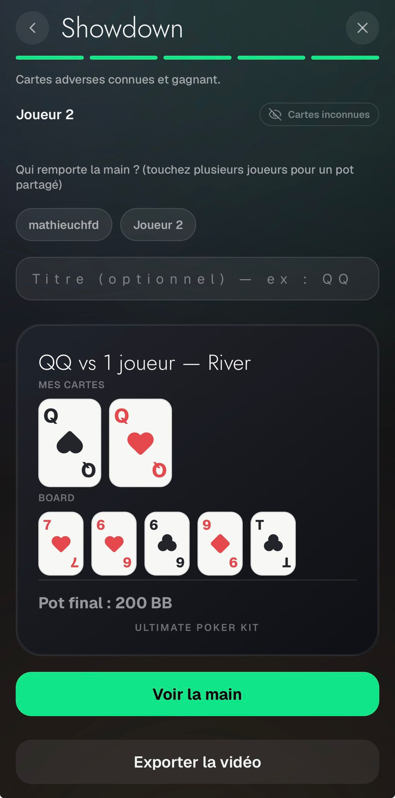
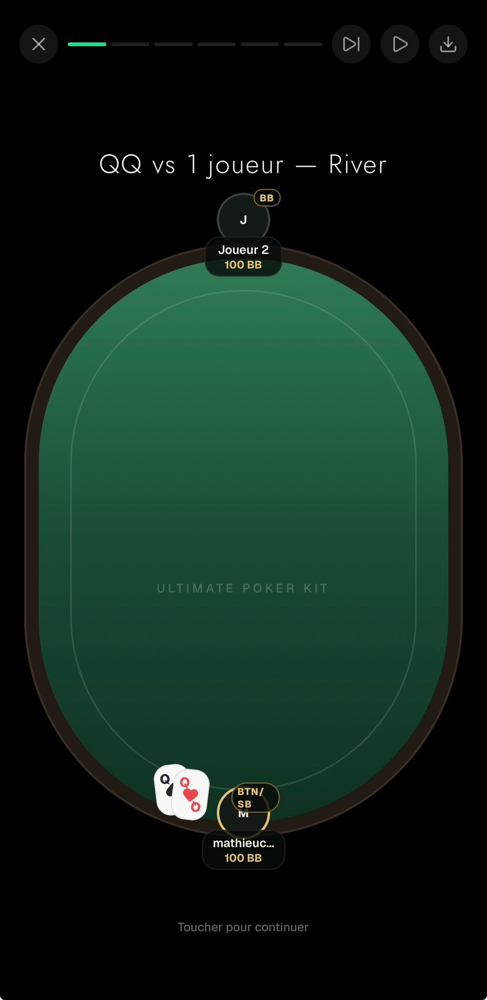
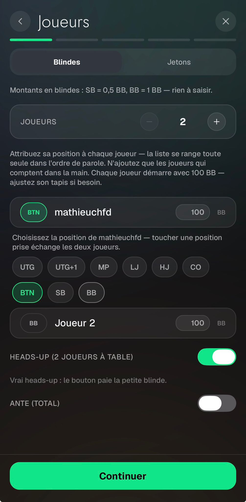

# Replayer — Feedback Mathieu (31 août 2026)

Source : WhatsApp, messages du 31/08 20:40, 20:44 et 21:05.

---

## 1. Le titre en haut de l'étape Showdown

> « Mettre Titre (Optionnel) au dessus de « Cartes adverses connues et gagnants » ? »



Le champ Titre est aujourd'hui coincé entre le sélecteur de gagnant et la carte de récap. Il remonte
en tête de l'étape.

Rien n'est autofocus sur cette étape et l'auto-save ne dépend pas de l'ordre de rendu, donc c'est un
simple déplacement de bloc. Seule précaution : plusieurs blocs portent un `marginTop` qui s'empile
sur le `gap` du conteneur — à reprendre en même temps, sinon l'espacement bouge à vue d'œil.

## 2. « BTN/SB » alors que heads-up est décoché — régression de la veille

> « Lorsque l'option HU n'est pas activée, BTN s'appelle BU non pas BTN/SB dans tous les cas. »
>
> puis, deux messages plus tard : « BTN s'appelle BTN pas BTN/SB. J'ai mis BU parce que c'est une
> autre abréviation pour bouton, mais on reste sur celle que tu as mise obsly »



Ce n'est pas une demande, c'est un bug introduit la veille avec l'option heads-up, et il vient du
**côté écriture**. `app/hand-replayer/index.tsx` persiste :

```ts
headsUp: isTwoHanded && headsUp ? true : undefined,
```

Une main enregistrée avec le switch **décoché** stocke donc `undefined`, pas `false`. À la lecture,
`play.tsx` appelle `computeBlindPosting(hand.players, 0, 0, hand.headsUp)` et tombe sur le fallback
`headsUp ?? true`, délibérément conçu pour les mains d'*avant* la feature — et qui doit le rester.

Conséquence : **la même main affiche « BTN/SB » et compte la petite blinde en argent mort dans le
pot**. Les deux moitiés se contredisent.

Correctif : `headsUp: isTwoHanded ? headsUp : undefined` — `false` quand le switch est décoché à deux
joueurs, `undefined` seulement au-delà de deux joueurs (où la question n'a pas de sens) et pour les
mains d'avant. Plus un test qui épingle qu'une main HU décoché ne se relit pas en heads-up.

**Et le badge déborde.** Visible sur la même capture : « BTN/SB » passe sur deux lignes et recouvre
l'avatar. Le badge est en absolu **dans le cercle d'avatar de 44pt**, ce qui ne laisse que 34pt de
texte, et « BTN/SB » en 8pt extrabold mesure pile autour de ça. Il sort vers le pod (74pt de large).
Attention au `zIndex` : la règle du fichier, posée la veille, est que tout `zIndex` doit être doublé
d'un `elevation` égal, sans quoi Android réordonne.

## 3. Les mises devant les joueurs

> « Lorsqu'il y a un joueur en BB : mettre (1BB) devant lui. Si il y a un joueur en SB mettre (0.5BB)
> devant lui. Avant la première action de relance.
>
> Lorsque c'est HU, BTN/SB a (0.5BB) devant lui et BB (1BB) devant lui. Avant la première relance. »

État actuel : les blindes **existent déjà** comme actions de type `post` — elles entrent dans les
contributions dès la première frame du beat preflop, le pot les compte et les tapis sont déjà
réduits. Elles n'ont simplement **aucun visuel** : `animatedActions` les filtre, donc elles n'ont
même pas de bulle d'action.

**Décision : les blindes, et rien d'autre.** Une première version affichait la mise de la street en
cours devant chaque joueur — la vraie table — mais Rémy l'a écartée à l'essai : chaque autre mise
s'annonce déjà par sa bulle d'action, donc un jeton en plus disait deux fois la même chose. Les
blindes sont l'exception parce que les posts sont justement filtrés hors des bulles.

Elles disparaissent à la première relance, la limite que donne Mathieu lui-même — à partir de là les
bulles portent l'histoire. Un call n'est pas une relance. Le champ s'appelle `blind` sur le
view-model du siège, pas `bet` : le nommer largement invitait à y remettre autre chose.

**Le détail qui compte** : sa capture est le beat d'**intro**, qui ne porte aucune action du tout. Si
le jeton se dérive uniquement des contributions révélées, il n'y a rien à voir exactement là où il
regardait. Les blindes du beat d'intro se dérivent donc de `computeBlindPosting`, et des
contributions ensuite.

`deadBlinds` et `ante` ne sont attribués à aucun siège : par définition aucun joueur assis ne les a
postées, elles restent dans le pot.

## 4. Heads-up sous l'ante

> « Mettre option HU en dessous de option ante (feature moins utilisée imo) »



Le switch descend sous le bloc ante — **et l'indice « argent mort » descend avec lui**. C'est cet
indice qui explique le switch : il n'apparaît que lorsque HU est décoché à deux joueurs. Le laisser
en haut le séparerait de sa cause par tout le bloc ante.

## Clos — pas un bug

**La vidéo « trop lente »** (20:37, média `00001165`). Rémy : « Elle est à la bonne vitesse […] c'est
pas ton tel qui est en mode ralenti ? ». Mathieu : « Ah ouais t'as raison, j'pense c'est juste la
première fois que j'ai regardé la vidéo ». Rien à faire.
